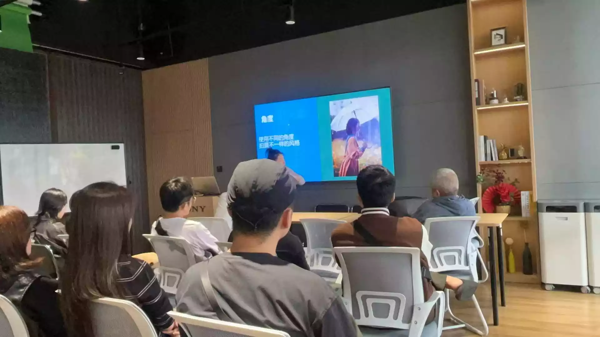
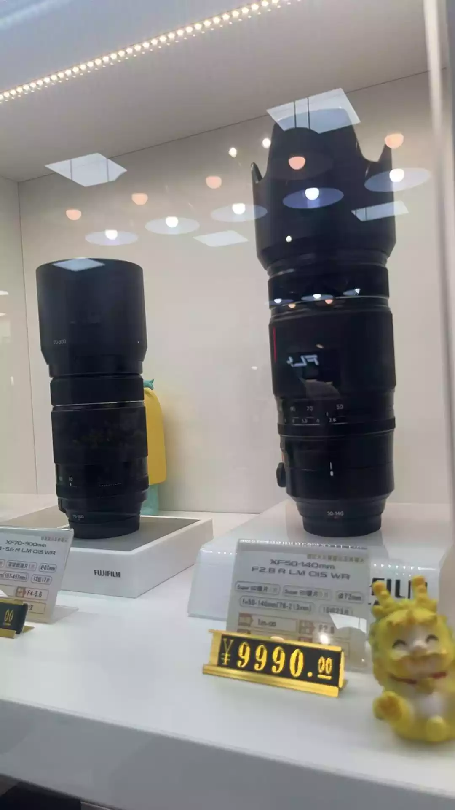

昨天和蒋蒋一起报名参加了 Sony 的线下人像鉴赏课，这是我第一次参加品牌官方的鉴赏课、交流会

这样的举办形式，之前倒是有了解过 Mazda，会在当地定期开展交流会，可以让用户直接和设计师或工程师，进行面对面的沟通，所以感觉还蛮新奇的，很有意思

想到昨天的课，印象最深的就是关于亚洲人的相貌方面：中国人的五官比较扁平，以正面全脸的形式拍照，很常见、很日常，当然也可能很普通，这也是很多新手摄影师，很难拍出 “氛围感人像” 的关键原因

“侧脸去拍照会能够一定程度突出五官的立体感”，老师讲道，并附上一些例图，“但是模特躺在草地上，侧拍的这种，需要模特颧骨突出，才能比较好的出片”

这段话让我难以忘怀，一定程度上给了我一点思路哈哈。之前对于人像摄影，比较信奉于模特的姿势和动作

> 这一点老师也讲了一个小技巧：哪疼摸哪，头痛摸头，手痛摸手……也算是有一个好记的万金油公式

关于“颧骨突出所适合的拍摄角度”这个说法，在我看来，感觉比较偏向于健美、绘画中讲究的人体结构（骨架、形体）一类。如果想要深入一点的话，可能会涉及到体态、形态方面的知识，属于人体的美学范畴哈哈哈哈

也就是需要精准一点，好好观察，试着找出模特身上，作为个人特质，比较富有美感、想要更加突出的特征；抑或是通过沟通交流，了解到相对不自信的点

最后通过摄影师对角度的理解，尽量避开模特身上的缺点，突出优点

> 其实也突然联想到，蒋蒋总说，拍照的刘海都乱了也不提醒一下

摄影师可能更多的关注于构图和光影去了，忽略掉了模特认为的小缺陷

总的来说，就是人体美学方面的观察还不够。需要像画家一样，镜头作笔，勾勒出模特中意的一帧定格

> 能前期解决的就不要后期，可以节省后期整理的时间；减少 ps 的工作难度，让画面更加自然真实

而后老师的一句话说很是戳心窝哈哈哈哈，我们普通人拍人像，哪有模特给你拍（笑死），不都是拍拍家人、亲戚朋友什么的。既然不是专业模特，没办法咔咔给你想要的效果，所以只能试着去观察、去引导哈哈

想起前几天看到的一篇推文，里面提到何为观点与想法，感觉也很应景

> 观点是来源于观察、阅读、总结、思考、实践，而不是拍脑袋拍出来的。想法是什么，是建立在有特色的个人观点上，特别是跟其他人不同的观点才会被称之为有想法的人

上课老师讲的理论，算是对我之前的学习体系有了一个验证（也就是正向反馈）。那按照老师给到的启发，顺藤摸瓜、灵感涌现，有了更多的思路，即有了自己的想法

所以灵感枯竭的时候，完全可以就去换个环境，看看展览、听听讲座什么的，可以将思路打开，引发更多思考

> 后记
>
> 我是 Fuji 党，参加完 Sony 的鉴赏课后，也去摸了摸富士的最新机器，不禁感叹，拿在手里就像一台精密的仪器——精准而优雅，确实能给你更好的精力去专注于摄影本身，让每一次按下快门，都变成了一种享受
>
> 试拍了下，主要是对焦、镜头马达的机械震颤，以及按下快门，遮光叶片闭合撞击的一瞬，让我浑身颤栗。我的妈，太舒服了！！！手感无敌
>
> 不过想了想，对于目前的机器，也算知足
>
> 物质的投入是永无止境的，我已经拥有了这个世代不过时的机器硬件、足以匹配需求的镜头和设备，我觉得更多精力应该从理论中来，投入到实践中去，在一次次的理论和实践互相应证的契合中，去找到一片属于自己的快闪空间！
>
> 真的受益无穷~
>
> 
