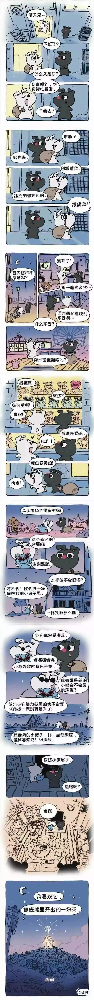

> 案例分析：
>
> 重庆小哥，30 岁出头，做室内装修，月薪 1-2w，刚还完房贷车贷，结婚女方要求买新房

### 关于买新的婚房作为生活保障

这个东西如果是必须的，那可能是一个合理的需求～得未来有一个地方住的保障；但在已有旧房的条件下提出保障，则是对方单方面想要的一个保障，这不是一个很好的状态。

举个例子，丈夫很爱他的太太，在**条件允许**的情况下，自愿买各种各样的东西，让她觉得很安心、很好，这个是没问题的，完全出于自愿。

那如果对方自己想要单方面的这个保障，那么本质上是在保障两个人分开之后的生活。在一起的时候，要为分开之后的利益做保障。。。这是一个很恐怖的事情，明明有一个可商量的余地，比如有点积蓄后，再买一个什么的。况且已经有地方住的情况下，本身就是对生活的一个保障。

### 两个人在一起的目的

两个人在一起的目的就是一起把日子过好，生活越来越好，这是一个理想的情况

现在在已有房产的条件下，需要付出巨大的代价买房，会让自己这边的生活水平急剧下降，日后如果再有孩子等等，这是一颗巨大的雷

有个说法叫做：**贫贱夫妻百事哀**。一旦生活过的捉襟见肘，可能会因为多吃了口鸡蛋就吵得不可开交

还没结婚就因为金钱的问题吵成这个样子，那么可想而知，未来的生活肯定也会因为钱的问题引发各种争执，那这样的结局是什么？

**不要因为一个不合理的要求，让自己背上不属于自己的压力**

因为**一段感情，最重要的就是两个人过的舒服**。如果一对夫妻，因为内心中各种各样的心结导致争吵，那么这样的感情是不长久的

新人刚开始，肯定会有各种各样的不信任，这是肯定的。那最后能做的，就是在相处的过程中，把结解开。如果无法解决问题，则慎重之，需要特别注意

### 物质的想法是家庭的观念？

恋爱是两个人的事，而婚姻是两个家庭的事情

可怜天下父母心，父母都是希望自己女儿好、儿子好

此时夫妻之间就应该统一阵线，各自哄好各自的家庭，这就是一个最好的状态

如果两个人在一起，有一方特别特别听家里的话，那么这段感情也是不会好的

**一对夫妻，两个人一定要有自己的主见，在一起最好的状态就是互相为对方挡事儿**

### 对方提出：不管旧房子卖多少，要结婚还不是得卖？

对方父母只考虑自身儿女的利益，而不考虑实际情况，本质上还是拿婚姻作为交易

### 关于攀比，觉得亲戚朋友风风光光

夫妻之间的攀比，没有上限，不管过的多好，总有人比你过的更好

看到别人吃好的穿好的，有点虚荣心当然正常

但两个人在一起一条心，一起经营自己的生活，让日子越过越好，这才是最重要的

### 最好的状态

嫁给爱情或者嫁给金钱是每个人不同的选择，但很少有人能嫁给爱情，更少有人能嫁给金钱

爱情说到底还可以努力去经营，各自改变自身的缺点去为感情做出贡献

但金钱是装不出来的，没有就是没有

二十岁出头的年龄，能自力更生、独当一面都已经很不错了；三十岁出头能自己有能力买车买房，已经是普通人中的佼佼者了

有多少人结婚可以在这样的年龄真正不靠父母结婚的呢？除非是富二代

所以，最好的状态便是：我喜欢你，恰好你也喜欢我

爱不是用嘴说出来的，看不见也摸不着，更不能用物质去衡量

要闭上眼，用心去好好感受！

