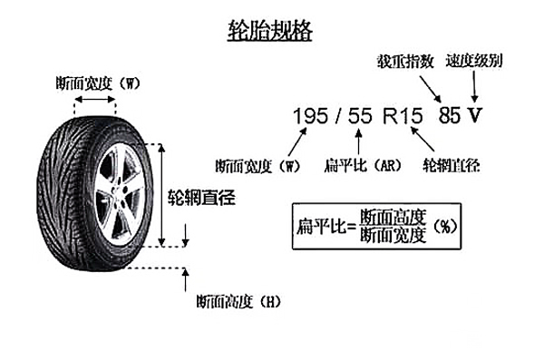

> Notion 转换格式有问题，待文章完善后修复

# 思路

任何一辆车在改装之前都应该开出去溜两圈，不说熟悉原厂车的手感，声浪特点，最起码也得知道改装完前后车有哪些进步

> 你可以选择一个标准赛道（例如地平线 4 阿斯特莫传承环道），记录下原厂最快的圈速
> 

如果决定好开始改装的话，只需要围绕 3 个底层逻辑：

1. **先定上限**：评分等级
   
    > PI (Performance Index): 性能指标，用来打分、衡量表现的量化标准
    游戏中从高到低分为 7 个组别：X - S2 - S1 - A - B - C - D，详见`附录 A`
    > 
2. **改装方向**：竞速 / 漂移 / 直线 / 拉力or越野，按方向选择套件
3. **最后调教**：马力↔重量↔抓地力↔操控

最终的目的，就是在限制的 pi 值以内（例如 A 级 800 或者 S1 级 900），通过更好的配件组合，把车辆的基础面板数据堆到最好（主要就是推重比更高），并且手感调教到最优（前后重量占比 50:50，侧向 G 值合理）

> 
> 
> - 推重比：每 1 吨车重能分到多少匹马力
>     
>     计算公式：马力（Ps）/ 重量（T）
>     
>     | 推重比区间 | 定位 | 驾驶体验 | 典型车型 |
>     | --- | --- | --- | --- |
>     | **≤100** | 代步入门 | 动力偏弱，加速慢，适合城市低速通勤 | 部分小型车、入门级家用车 |
>     | **100~120** | 家用够用 | 满足日常需求，超车 / 爬坡不费劲 | 主流家用轿车、紧凑型 SUV |
>     | **120~150** | 动力良好 | 驾驶有乐趣，响应快，高速从容 | 高功率家用车、运动型轿车 |
>     | **150~200** | 性能进阶 | 加速迅猛，推背感强 | 入门跑车、性能钢炮 |
>     | **≥200** | 超跑 / 性能怪兽 | 极致加速，贴背感明显 | 顶级超跑、改装性能车 |
> - 侧向 G 值（横向 G 力）：通俗一点就是转弯时被甩出去的最大力量
>     
>     反映车辆**过弯抓地能力**，数值越高理论过弯速度越快，但它只是车辆性能的**一个维度**，参考如下：
>     
>     | PI | 侧 G | 公路赛推荐 |
>     | --- | --- | --- |
>     | B | 1.3-1.4 | 原厂胎/白边轮胎/直线胎 |
>     | A | 1.7-1.9 | 拉力胎/漂移胎（马力大/宽体后驱） |
>     | S1 | 2.1-2.3 | 拉力胎/半热熔胎 |
>     | S2 | 2.5+ | 全热熔胎/直线胎 |
>     - 操控调教可能高一些，拉力越野可以更低一点，且无脑拉力/越野轮胎
>     - 以**实际圈速**和**驾驶手感**为最终依据，而非机械追求侧 G 数值
>     高侧 G 适合 “稳扎稳打” 的走线型驾驶，而低侧 G + 高动力适合 “晚刹车 + 出弯全油” 的激进风格，两者均可跑出好成绩

分数高不一定是最好的，但是分数低一定是不够好的（因为 pi 值还没用完）

所以根据下表，优先决定你的汽车组别，再围绕着该组别的评分上限，进行特定方向的改装

| 等级 | (PI) 分数范围 | 核心特点 | 适合玩家 | 常见用途 |
| --- | --- | --- | --- | --- |
| D 级 | 100-500 | 入门级车辆，速度慢、操控稳定，多为家用车、小型车 | 纯新手、休闲玩家 | 新手教程、探索地图、低难度赛事 |
| C 级 | 501-600 | 基础性能提升，加速和极速略有增强，多为紧凑型车、经济型 SUV | 初级玩家 | 初级赛事、短途竞速、部分季节任务 |
| B 级 | 601-700 | 性能均衡，操控与速度平衡，多为中型轿车、入门级跑车 | 中级玩家 | 中级赛事、综合赛道、多数常规活动 |
| A 级 | 701-800 | 高性能基础级，速度与操控表现良好，多为运动型轿车、主流跑车 | 中高级玩家 | 高级赛事、公路竞速、拉力赛基础组 |
| S1 级 | 801-900 | 接近顶级性能，加速快、极速高，多为高性能跑车、改装车 | 高级玩家、竞技爱好者 | 专业赛事、多人联机、拉力赛高级组 |
| S2 级 | 901-998 | 赛事最高等级，速度极快，多为超级跑车、顶级赛车 | 资深玩家、竞速高手 | 游戏最高级别赛事、速度挑战赛 |
| X 级 | 999 | 极限性能，需深度调教改装，多为超级跑车改装版、概念车 | 专家级玩家、改装达人 | 无规则任务、自由探索、世界纪录挑战 |

# 改装

决定好目标评级后，我们就进行汽车部件的改装，部件改装的优先级使用**优先度**来评定

- 高优先度部件：必须优先考虑
- 中优先度：根据车况酌情考虑
- 低优先度部件：凑分用

核心目的就是 pi 评分接近最高的情况下，推重比尽可能更高（更大的马力，更低的重量）

| 类别 | 部件 | 作用 | 优先度 | 备注 |
| --- | --- | --- | --- | --- |
| 改造 | 置换发动机^1 | 影响车辆的动力输出与性能 | 中 | 低性能车换发动机可以显著提升马力
高性能车原厂发动机不一定弱，请酌情考虑 |
|  | 传动系统置换 | 决定汽车的驱动方式 | 中 | 前驱有一定稳定性
四驱稳定性拉满
后驱上限最高 |
|  | 进气 | 进一步压榨发动机性能，提升扭矩 | **高** | 默认自然吸气动力线性
涡轮轻但有迟滞，高转发力
机增重无迟滞，低转更优
离心机增介于涡轮和机增之间 |
| 底盘与操控性 | 刹车 | 提升制动力度、散热性能，缩短刹车距离 | **高** | 保命刚需 |
|  | 弹簧及阻尼器 | 调整车身高度、悬挂支撑性与滤震效果，提升操控稳定性与驾驶路感 | 中 | 选对应场景的最高性能组件 |
|  | 前防倾杆 | 抑制车辆过弯时的车头侧倾，提升前轮抓地力与转向精准度 | **高** | 必装，解锁硬度调教提升巨大 |
|  | 后防倾杆 | 减少车尾侧倾，优化车尾跟随性，提升车辆整体过弯极限 | **高** | 必装，解锁硬度调教提升巨大 |
|  | 底盘强化/防滚架 | 提升车身刚性，减少行驶形变，增强操控精准度与碰撞安全性 | 中 | 底盘强化提升操控
防滚架一般拉力越野装，因为会增重 |
|  | 车重减轻 | 提升动力推重比，优化加速性能、操控灵活性与能耗表现 | 中 | （最后考虑）高分车必改；低分车 pi 提升会很大，如果 pi 有限，需酌情考虑，太轻不经碰 |
| 传动系统 | 离合器 | 承受更大扭矩，防止动力打滑，保障稳定，并减少换挡速度 | 中 | AT 降低换挡速度
MT 玩家可以不改 |
|  | 变速箱 | 解锁传动比设定，提升加速与极速表现 | **高** | 一般只需要解锁最终传动比调教，如果需要解锁所有档位传动比，则拉满 |
|  | 传动系统 | 减少动力传递损耗，提升传动效率 | 低 | 主要是减轻车重，蚊子腿再小也是肉 |
|  | 差速器 | 优化动力分配，提升车辆起步、过弯时的抓地力与牵引力 | **高** | 必装，解锁可调锁止率提升巨大 |
| 轮胎与轮毂 | 轮胎踏面胶料 | 提升轮胎抓地力，增强干 / 湿地操控性能与制动表现 | **高** | 按场景选择，pi 提升大 |
|  | 前轮胎宽^2 | 提升前轮抓地力与转向稳定性，增强转向响应与驾驶路感 | 中 | 会影响极速 |
|  | 后轮胎宽^2 | 提升后轮抓地力，优化起步加速与过弯牵引力，减少动力打滑 | 中 | 避免后轮打滑！！！ |
|  | 轮毂样式 | 更换个性化轮毂样式，提升车辆外观颜值 | 中 | 可以减重，也可以增重减 pi |
|  | 前轮毂尺寸^2 | 优化转向支撑性与视觉效果 | 中 | 可以减重 |
|  | 后轮毂尺寸^2 | 提升动力传递效率与车尾行驶稳定性 | 中 | 可以减重 |
|  | 前轮距 | 提升车头行驶稳定性，优化转向精准度与高速行驶表现 | 中 | 越宽越稳，越窄越灵 |
|  | 后轮距 | 增强车尾稳定性，提升车辆过弯极限与牵引力表现 | 中 | 越宽越稳，越窄越灵 |
| 空气动力套件与外观 | 前保险杠 | 优化车头空气动力学（如导风、增加下压力），同时提升外观视觉效果 | 中 | 最后改
会降低极速 |
|  | 尾翼 | 提供高速下压力，提升车尾稳定性，同时增强外观运动感 | 中 | 最后改
大幅减少后轮打滑，根据手感来决定 |
| 发动机 | 进气系统 | 增加进气量，提升发动机动力与油门响应速度 | 低 |  |
|  | 燃料系统 | 保障充足燃油供给，提升燃烧效率 | 低 |  |
|  | 点火系统 | 增强点火强度，优化燃烧效率，提升动力与燃油经济性 | 低 |  |
|  | 排气系统 | 降低排气阻力，提升排气效率，增强动力输出与声浪表现 | 低 |  |
|  | 凸轮轴 | 调整气门正时与升程，提升发动机高转速动力输出，优化动力曲线 | 低 |  |
|  | 气门 | 提升发动机高转速工作稳定性，适配大马力改装，增强部件耐用性 | 低 |  |
|  | 双涡轮 | 大幅提升进气压力，为发动机爆发更强的动力输出 | **高** | double 快乐 |
|  | 中间冷却器 | 增强涡轮发动机动力与运行稳定性 | 低 |  |
|  | 飞轮 | 降低发动机转动惯量，提升油门响应与转速攀升速度，增强驾驶爽感 | **高** | 转速提升更快 |
1. 无可替代的原厂发动机

[地平线中，无可替代的原厂发动机](https://wataaaame.github.io/posts/learn/car/forza_horizon/irreplaceable_original_engine/)

1. `扁平比 = 胎壁高度H / 胎宽W`，越低支撑力越好
   轮胎规格不变的情况下，轮毂越大，断面高度越小
   
   
   
    轮毂尺寸对于弯道驾驶的影响：
    **漂移车后轮可以改最大轮毂、最薄轮胎和高胎压**，这样车子在侧滑的时候轮胎不会变形从而整辆车滑行
    反过来**跑车和赛车都用小轮毂+厚大轮胎**，这样减速和过弯的时候通过地面的压力使轮胎变形，缓冲车体的离心力（惯性）。增加过弯时的最大速度又能保持住可控状态和走线

# 调校

请在车辆信息中查询前端重比和重量，调教会用到

| 部件 | 项目 | 解释 | 方位 | 作用 | 调教 |
| --- | --- | --- | --- | --- | --- |
| 轮胎 | 胎压 | 轮胎软硬 | 前侧 | （低-高）
抓地高 - 转向灵 | 如果改装没有换胎面，这里可以多降一点，以提升抓地力
赛道：2.2–2.4 bar
拉力/越野：1.8–2.2 bar
漂移：max |
|  |  |  | 后侧 | （低-高）
抓地高 - 转向甩 | 如果改装没有换胎面，这里可以多降一点，以提升抓地力
赛道：2.4–2.6 bar
拉力/越野：1.9–2.3 bar
漂移：max |
| 齿轮设备 | 前进档 | 变速箱 n 圈
轮胎 1 圈 | 最终传动比
（整体） | （极速-加速）
极速高 - 加速快 | 可以跑原厂齿比，如果极速时转速达不到 max，则优先调教最终传动比
向右调至 2 以上的极速降低，再向右调最高档位至 3 左右的极速降低
如果刚调就下降，则不用动最高档 |
|  |  |  | 1-n 档 | （极速-加速）
极速高 - 加速快 | 调节特定档位特性，例如全油门起步打滑，可以将一档向左拉
同时，可以适配发动机功率曲线，通过齿比控制转速提升速度 |
| 轮胎定位 | 外倾角 | 稍息-立正 | 前侧 | （负-正）
转向抓 - 危险
影响直线稳定 | 找个环岛，持续转向，通过查看外侧轮胎转向时的温度进行调整（键盘按 T 调出参数表）
最后达到外侧温度略高即可 |
|  |  |  | 后侧 | （负-正）
转向抓 - 危险
影响直线稳定 | 一般为前轮一半 |
|  | 束角 | 外八-内八 | 前侧 | （内-外）
转向灵 - 直线稳
影响极速和稳定 | 漂移车才考虑 |
|  |  |  | 后侧 | （内-外）
直线稳 - 转向甩
影响极速和稳定 | 漂移车才考虑 |
|  | 前后倾角 | 变相改变轴距
前倾减少轴距
后倾增加轴距 | 角度 | （低-高）
（前倾-后倾）
转向灵 - 直线稳 | 最后微调 |
| 防倾杆 | 防倾杆 | 转弯时左右轮的扁担
管左右轮拉扯 | 前侧 | （软-硬）
转向灵 - 转向稳 | ***以下内容待验证***
前后推重比 50:50 最佳
拿前后重比 46:54 的中置四驱举例：
四驱：接近中和，48：52，调整 2%，
后驱：易甩尾，52:48，调整 6%
前驱：易推头，38:52，调整 8%
调教页面总值为 64，需自行计算百分比 |
|  |  |  | 后侧 | （软-硬）
转向稳 - 转向甩 |  |
| 弹簧 | 弹簧 | 车身上下支撑（贴地） + 整体侧倾幅度（姿态） | 前侧 | （软-硬）
转向钝 - 转向灵
烂路稳 - 烂路飞 | ***以下内容待验证***
X=前，Y=后
T=车重（吨），N=常数（112.5），F:R=前后重比（46:54）

$\begin{cases}
X + Y = 2(TN)
\\
\dfrac{X}{Y} = \dfrac{F}{R}
\end{cases}
\\
\boldsymbol{X = 124.2,\quad Y = 145.8}$ |
|  |  |  | 后侧 | （软-硬）
转向钝 - 转向甩
烂路稳 - 烂路飞 |  |
|  | 车身高度 | 重心高度 | 前侧 | （低-高）
转向稳 - 转向钝
竞速 - 拉力/越野 | 赛车可直接最低 |
|  |  |  | 后侧 | （低-高）
转向稳 - 转向钝
竞速 - 拉力/越野 | 赛车可直接最低 |
| 阻尼 | 回弹硬度 | 弹簧回弹速度 | 前侧 | （软-硬）（快-慢）
竞速/拉力 - 越野攀岩 | ***以下内容待验证***
X=前，Y=后
N=常数（17 左右，如果容易弹跳可以高点），F:R=前后重比（46:54）

$\begin{cases}
X + Y = N
\\
\dfrac{X}{Y} = \dfrac{F}{R}
\end{cases}
\\
\boldsymbol{X = 7.82,\quad Y = 9.18}$ |
|  |  |  | 后侧 | （软-硬）（快-慢）
竞速/拉力 - 越野攀岩 |  |
|  | 压缩硬度 | 弹簧压缩速度 | 前侧 | （软-硬）（快-慢）
拉力/越野 - 竞速 | 一般在回弹硬度的 50%～75% |
|  |  |  | 后侧 | （软-硬）（快-慢）
拉力/越野 - 竞速 |  |
| 空气动力 | 下压力 | 牺牲极速换稳定 | 前侧 | （车速-操控）
极速高 - 抓地强 | 空气动力默认
如果转向不够，轻微提高前下压力
如果是超级大马力车，可以无脑提高前下压力 |
|  |  |  | 后侧 | （车速-操控）
极速高 - 抓地强 |  |
| 刹车 | 制动力 | 刹车侧重 | 平衡 | （前-后）
前轮抱死 - 后轮甩尾 | 一般不用动，漂移车才考虑 |
|  |  | 刹车效果 | 压力 | （低-高）
制动弱 - 制动强 | 键盘无线性扳机，可以适当低一点，8% 左右
熟练线性操作可以适当提高 20%
 低性能车将刹车距离调整至最短，一般调整不超过 15% |
| 限滑差速器^1 | 前侧 | 管前轮的动力分配 | 加速 | （低-高）
前驱：前驱推头，加重更推头
后驱：没用，前轮无动力
四驱：分配前轮动力，影响车头灵活 | 一般默认
如果踩油门转向不足，需提高加速差速器，且后比前高，有助于增强转向能力
转向过度则反着来
踩油门出弯容易飘，缩小前后加速差速器的差距
后比前越高，转向越厉害，但前越低。踩油门入弯越不容易 |
|  |  | 减速时依然有一定锁止力 | 减速 | （低-高）
转向灵 - 制动稳 | 一般默认
松油门动一下方向就转很多，提高前轮设定 |
|  | 后侧 | 管后轮的动力分配 | 加速 | （低-高）
后驱：越高 → 车尾越稳、不甩尾
前驱：没用，后轮无动力
四驱：分配后轮动力，决定车尾灵活 |  |
|  |  | 减速时依然有一定锁止力 | 减速 | （低-高）
转向灵 - 制动稳 | 一般默认
松油门转向不足，降后轮低设置 |
|  | 中央 | 只有四驱才有
管前轴和后轴的动力分配，比如 50:50、40:60 | 平衡 | （前测-后侧）
偏前驱 - 偏后驱 | 向后调有助于转向 |
1. 限滑差速器（LSD）
   
    普通差速器：转向时，左右两侧轮胎，外侧走大圈，内侧走小圈，行程不一样，所以速度并不一致，差速器便是解决这个问题，让两侧轮胎用不同速度转向
    
    但是在极限高速转向时，外侧轮胎受到的压力远大于内侧，给同样驱动力的情况下，外侧轮胎的旋转比内侧更困难，所以会给内侧轮胎分配更多的力，本来受到压力就低，分配的动力又更多，就很容易打滑，所以就需要限制差速器的工作，让动力均匀分配，这便是限滑差速器的使用场景
    

# 测试

测试方法：

- 自定义蓝图：选择综合性赛道（直线、各种类型弯道）、夏季、圈数
- 第一次应该往转向过度调，然后再微调回来，就能更趋近于极限

微调思路：

|  | 防倾杆 | 弹簧 | 阻尼 | 前空力 | 后空力 | 轮胎束角 | 轮胎前后倾角 |
| --- | --- | --- | --- | --- | --- | --- | --- |
| **转向过度** | 前硬后软 | 前硬后软 | 前硬后软 | 减压力 | 加压力 | 前轮减小 | 增大 |
| **转向不足** | 前软后硬 | 前软后硬 | 前硬后软 | 加压力 | 减压力 | 前轮增大 | 减小 |
| **瞬间操控过于灵活** | 总体调软 | 总体调软 | 总体调软 | 减压力 | 加压力 | 略微减小 | 略微增大 |
| **瞬间操控过于延迟** | 总体调硬 | 总体调硬 | 总体调硬 | 加压力 | 减压力 | 略微增大 | 略微减小 |
- 如果车辆颠簸发现不稳定，就是车跳的太厉害，可以把车弹簧调硬，可以减少颠簸
- **性能平衡公式**：**侧 G + 推重比 + 刹车性能 + 悬挂调校 = 圈速**，四者需协同优化

# 参考

[【极限竞速地平线4】调校入门详细教学](https://www.bilibili.com/video/BV1tb411F766)

## ToDo

[【极限竞速地平线4】漂移调校教学+漂移走线教学](https://www.bilibili.com/video/av34083073/?spm_id_from=333.788.comment.all.click)

[【极限竞速地平线4】越野拉力调教教学](https://www.bilibili.com/video/av33971036/?spm_id_from=333.788.comment.all.click)

[【地平线5】调校全面教学，全方位解析，包学会](https://www.notion.so/5-33c3c6e89e178027b841c56ca59697e7?pvs=21)