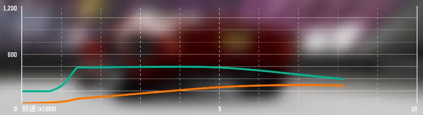
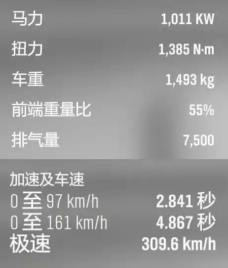
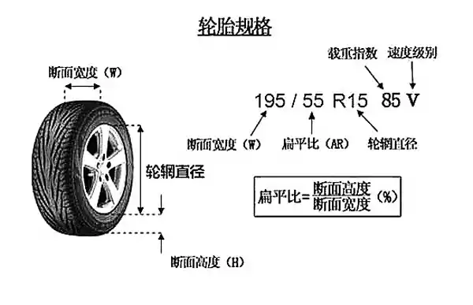

# 前言

本教程仅以制作更有线上竞争力的调校为目标，为达到这一目标，需要考虑的不仅仅是操作手感，起步优势、劲敌圈速、对抗性等因素均需考虑在内

文中涉及到的调校思路可以广泛地应用于《极限竞速：地平线》系列游戏，具体的调校数值则仅限在《极限竞速：地平线4》中使用。每代物理部分都有轻微变动，不可一概而论

# 思路

> 首先要确保自己具备测试的能力

如果技术差到测不出不同调校之间的差异，则不建议自己做这类调校，直接使用现成的调教方案：[极限竞速地平线 4 线上车辆与调校](https://docs.qq.com/sheet/DVFF1RkJEWGRMVmFO)

---

> 任何一辆车在改装之前都应该开出去溜两圈，不说熟悉原厂车的手感，声浪特点，最起码也得知道改装完前后车有哪些进步

如果决定好开始改装的话，你需要明确自己的需求：

1. 要改哪台车？`附录 A`

2. 要改到哪个等级？（D / C / B / A / S1 / S2 / X）`附录 B`

3. 要用在哪类比赛里？（公路 / 拉力 / 越野 / 直线加速）`附录 C`

4. 要用在哪类赛道上？（偏操控 / 偏动力 / 均衡 / 特殊情况）`附录 D`

调校之初，你并不需要明确知道这些问题的答案，**但是在想清楚之前，千万不要进入精调的阶段**

最终的目的，就是**在限制的 PI 值以内**（例如 A 级 800 或者 S1 级 900），**通过更好的配件组合，把车辆的基础面板数据堆到最好**（主要就是推重比 `附录 E` 更高），**并且手感调教到最优**（前后重量占比 50:50，侧向 G 值 `附录 F` 合理）

分数高不一定是最好的，但是分数低一定是不够好的（因为 PI 值还没用完）

# 改装

为了达到改装件的最优化，需要解决三个问题：

1. PI 值是否达到了等级限制？
2. 是否尽可能选用了性价比高的改装件？
3. 花费的 PI 值有没有浪费在不适合这台车的性能倾向上？

**第一个问题最容易解决**：

在购买改装件或套用其他调校的时候，在“等级”一栏查看“结果”。如果“结果”为绿色向上的箭头，则代表PI值更高；

如果“结果”为红色向下的箭头，则代表PI值更低。需要注意的是，PI值高，不总是代表性能更好，具体要不要卡到极限，需要视情况而定

**第二个问题需要详细说明**，在此先不展开说明

**第三个问题也很好理解**：

举例来说，Bugatti EB110 的性能倾向为（偏中后段加速/操控），因此改装件应该让它更快的达到并保持中后段加速，且不应影响高速的操控

错误的改法就是给 EB110 加上直线加速胎，因为直线加速胎会降低高速抓地力，削弱中后段加速和高速过弯能力

## 改装件的选择

这里详细讨论刚刚提出的第二个问题：**是否尽可能选用了性价比高的改装件？**

- 高性价比：必须**优先考虑**
- 中性价比：根据车况**酌情考虑**
- 低性价比：凑分用

核心目的就是 PI 评分接近最高的情况下，推重比尽可能更高（更大的马力，更低的重量）

以下是所有部件一览表（按照改装界面顺序标定），具体说明见脚注标识对应的模块（分为动力和操控两个板块，序号不中断）

| 类别                  | 部件              | 说明                                                         | 优先度 |
| --------------------- | ----------------- | ------------------------------------------------------------ | ------ |
| 发动机                | 进气系统          | 增加进气量，提升发动机动力与油门响应速度                     | 低     |
|                       | 进气歧管/节气门   | 改善扭力，只适用于自然进气引擎                               | 高     |
|                       | 燃料系统          | 保障充足燃油供给，提升燃烧效率                               | 低     |
|                       | 点火系统          | 增强点火强度，优化燃烧效率，提升动力与燃油经济性             | 低     |
|                       | 排气系统          | 降低排气阻力，提升排气效率，增强动力输出与声浪表现           | 高     |
|                       | 凸轮轴            | 调整气门正时与升程，提升发动机高转速动力输出，优化动力曲线   | 低     |
|                       | 气门              | 提升发动机高转速工作稳定性，适配大马力改装，增强部件耐用性   | 低     |
|                       | 排气量            |                                                              | 低     |
|                       | 活塞/压缩比       |                                                              | 低     |
|                       | 增压器升级        | 大幅提升进气压力，为发动机爆发更强的动力输出                 | 高     |
|                       | 中间冷却器        | 增强涡轮发动机动力与运行稳定性                               | 低     |
|                       | 机油/冷却系统     |                                                              | 低     |
|                       | 飞轮              | 降低发动机转动惯量，提升油门响应与转速攀升速度，增强驾驶爽感 |        |
| 底盘与操控性          | 刹车^4            | 提升刹车效率                                                 | 中     |
|                       | 弹簧及阻尼器^5    | 调整车身高度、悬挂支撑性与滤震效果，提升操控稳定性与驾驶路感（PI 提升不应该超过 2） | 中     |
|                       | 前防倾杆          | 抑制车辆过弯时的车头侧倾，提升前轮抓地力与转向精准度         | 高     |
|                       | 后防倾杆          | 减少车尾侧倾，优化车尾跟随性，提升车辆整体过弯极限           | 高     |
|                       | 底盘强化/防滚架^6 | 提升车身刚性，减少行驶形变，增强操控精准度与碰撞安全性 不同情况下对性能有不同的影响，影响范围包含加速、刹车、极速和高速操控 | 中     |
|                       | 车重减轻^7        | 提升动力推重比，优化加速性能、操控灵活性与能耗表现 （最后考虑）高分车必改；低分车 PI 提升会很大，如果 PI 有限，需酌情考虑，太轻不经碰 | 高     |
| 传动系统              | 离合器            | 减少换挡速度 非手离或老车可以提升一点换挡速度 手离玩家可以不改，节省 PI | 中     |
|                       | 变速箱^3          | 解锁传动比设定，提升加速与极速表现 一般只需要解锁最终传动比调教，如果需要解锁所有档位传动比，则拉满 | 高     |
|                       | 传动系统          | 减少动力传递损耗，提升传动效率 主要是减轻车重，蚊子腿再小也是肉 | 低     |
|                       | 差速器            | 优化动力分配，提升车辆起步、过弯时的抓地力与牵引力           | 高     |
| 轮胎与轮毂            | 轮胎踏面胶料^8    | 提升轮胎抓地力，增强干 / 湿地操控性能与制动表现              | 高     |
|                       | 前轮胎宽^9        | 提升前轮抓地力与转向稳定性，增强转向响应与驾驶路感           | 低     |
|                       | 后轮胎宽^9        | 提升后轮抓地力，优化起步加速与过弯牵引力，减少动力打滑       | 中     |
|                       | 轮毂样式^10       | 更换个性化轮毂样式，提升车辆外观颜值/减重                    | 高     |
|                       | 前轮毂尺寸^10     | 优化转向支撑性与视觉效果                                     | 低     |
|                       | 后轮毂尺寸^10     | 提升动力传递效率与车尾行驶稳定性                             | 中     |
|                       | 前轮距^11         | 提升车头行驶稳定性，优化转向精准度与高速行驶表现             | 低     |
|                       | 后轮距^11         | 增强车尾稳定性，提升车辆过弯极限与牵引力表现                 | 中     |
| 空气动力套件与外观^12 | 前保险杠          | 优化车头空气动力学（如导风、增加下压力），同时提升外观视觉效果 | 中     |
|                       | 尾翼              | 提供高速下压力，提升车尾稳定性，同时增强外观运动感           | 中     |
| 改造                  | 置换发动机^1^13   | 影响车辆的动力输出与性能 低性能车换发动机可以显著提升马力 高性能车原厂发动机不一定弱，请酌情考虑 | 中     |
|                       | 传动系统置换      | 决定汽车的驱动方式 前驱有一定稳定性 四驱稳定性拉满 后驱上限最高 | 中     |
|                       | 进气^2            | 进一步压榨发动机性能，提升扭矩                               | 高     |
|                       | 车身套件升级^14   |                                                              | 中     |

## 动力

### 1 置换发动机

性价比高的发动机一般有以下特点：

- 低转速情况下，动力曲线比较平缓，马力增速较慢
- 中转速情况下，动力曲线比较陡，马力增速较快
- 高转速情况下，保持最大马力的转速区间较窄

标志性的发动机有：

- Racing V12

- 8.4L V10 + 离心增压

- 6.2L V8 + 离心增压

- 3.2L L6

- 1.6L L4 - VVT + 离心增压
- [无可替代的原厂发动机](https://wataaaame.github.io/posts/learn/car/forza_horizon/irreplaceable_original_engine/)

- ...

选用以上这类发动机的前提是：

- 变速箱有足够的挡位，保证发动机能保持在高转速区间，且挡位用完时能接近极速

- 变速箱齿轮比设计合理

### 2 进气

默认自然吸气无增压动力线性

-   涡轮轻但有迟滞，高转发力
-   机增重无迟滞，低转更优
-   **离心机增**介于涡轮和机增之间（性价比最高）

**在安装了离心增压之后，优先升级离心增压**，是性价比最高的发动机改装方式

### 3 变速箱

如果挡位过少，且每次换挡后都会回到低转速区间，也可以选择一些“反面典型”发动机，如各种 Turbo Rally 发动机

## 操控

### 4 刹车

只有在纵向抓地力充足的情况下（一般由轮胎胎面胶料、胎宽和空气动力套件决定），提升刹车效率才是有效的，否则只是在浪费PI值

### 5 弹簧及阻尼器

如果在动力不足的情况下升级拉力版/赛车版/漂移版弹簧及阻尼器，发现PI值增加超过2点，则应该优先考虑使用原厂的弹簧及阻尼器；实在不能满足需求时，再选择升级

赛车版和漂移版的可调校数值范围基本一致，拉力版则比较软。在这三者之间，**公路调校一般选择PI值需求最低的，拉力/越野调校一般选用拉力版**

部分原厂的弹簧也是可调的，这时候需要先对比一下可调校数值的范围，然后再考虑要不要升级

### 6 底盘强化/防滚笼

底盘强化 / 防滚笼升级造成的PI值增/减，是多个效果叠加而成的

**在抓地力充足的情况下，底盘强化 / 防滚笼升级一般会造成PI值降低**，因为其提升的性能远不如增重带来的负面影响大。对于公路调校来说，这样升级性价比较低；对于拉力或越野调校来说，需要在拉力路面/越野路面进行实测，一般只要有助于提升前中段加速，就是值得的

**在抓地力不足、马力过大的情况下，底盘强化 / 防滚笼升级一般会造成PI值升高**，因为它可以有效提升加速、刹车、极速和高速操控性能。如果是这种情况，在车重已经降至最轻之后，可以牺牲一点动力，将PI值用在底盘强化 / 防滚笼升级上

### 7 车重减轻

**提升几乎所有性能**

在动力可以满足基本需求的情况下，车重减轻一般是高性价比的升级选项

在不置换发动机、不更换或升级进气改造的情况下（也就是发动机动力曲线特性不变的情况下），车重较轻、马力较小的调校具有更好的操控、差不多的前中段加速、较弱的后段加速和较低的极速

### 8 轮胎踏面胶料

**几乎影响所有性能**

轮胎踏面胶料主要影响的是轮胎的抓地力，需要把纵向抓地力和横向抓地力分开来看：

-   纵向抓地力主要影响的是加速和刹车性能，偏前中段加速的调校，纵向抓地力一定要好
-   横向抓地力主要影响的是操控性能，偏操控的调校，横向抓地力一定要好

另一方面，不同的轮胎踏面胶料在不同路面、不同天气状况下的抓地力也是存在区别的。由于PI值会综合考虑各种情况下的抓地力，仅能在某种路面/某种天气情况下使用的轮胎踏面胶料往往从PI值角度来说具有较高的性价比

可以升级的轮胎踏面胶料一般有：

| 类型                         | 抓地力                                                       | 场景                                                         |
| ---------------------------- | ------------------------------------------------------------ | ------------------------------------------------------------ |
| 原厂                         | 见原厂轮胎表                                                 | 每台车情况不同，部分特殊胎面后面会详细讲，在此先不展开       |
| 怀旧赛车版                   | 横向抓地力约为拉力胎的86%                                    | 基本没用                                                     |
| 街车版                       | 横向抓地力约为拉力胎的88%                                    | 在A级或大马力后驱调校中可用                                  |
| 跑车版                       | 横向抓地力约为拉力胎的91%                                    | 在A级或大马力后驱调校中可用                                  |
| 拉力版                       | 在柏油路面和拉力路面都有不错的抓地力                         | 性能基本不受天气影响                                         |
| 越野版                       | 在柏油路面抓地力较差 在拉力路面和越野路面都有不错的抓地力 |                                                              |
| 赛车版 （地平线版）     | 横向抓地力约为拉力胎的108%                                   | 在柏油路面上性能基本不受天气影响                             |
| 赛车光头版 （地平线版） | 横向抓地力约为拉力胎的125%                                   | 仅能在干燥的柏油路面上使用                                   |
| 直线加速版 （地平线版） | 横向抓地力约为拉力胎的82% 纵向抓地力显著增加            | 有利于提升前中段加速性能和刹车性能 高速抓地力较差，削弱后段加速性能 仅能在干燥的柏油路面上使用 |

原厂胎中比较特殊的有：

| 类型                       | 抓地力                                                       | 场景                                       | 车型                                    |
| -------------------------- | ------------------------------------------------------------ | ------------------------------------------ | --------------------------------------- |
| 原厂越野胎                 | 同越野版                                                     | 受天气影响                                 | Raptor '11/ Ram Power Wagon / Hummer H1 |
| 原厂越野胎                 | 同越野版                                                     | 不受天气影响                               | Jeep Rubicon / Meyers Manx              |
| 看起来像赛车胎的赛车光头胎 | 干地不如普通的赛车光头胎 湿地不如赛车胎                 | 可以在湿地使用 从PI值角度来说性价比低 | Mosler MT900S                           |
| Toyo轮胎                   | 柏油路面性能接近赛车胎 拉力路面和越野路面比普通拉力胎性能要更好 |                                            | Hoonigan RS200                          |
| Goodyear轮胎               | 接近赛车光头胎                                               |                                            | 福特Falcon XA GT-HO FE                  |
| Michelin轮胎               | 接近赛车光头胎                                               |                                            | VW IDR                                  |
| Firestone轮胎              |                                                              |                                            | Porsche 917                             |
| BFGoodrich轮胎             |                                                              |                                            | Rahal Letterman的福特嘉年华             |

-   需要注意的是，有些车的轮胎踏面胶料显示名称与实际使用的胎面并不一致，这种情况主要出现在GT1赛车上，以AMG CLK-GTR为例：

    -   跑车版踏面胶料 = 赛车版踏面胶料

    -   赛车版踏面胶料 = 赛车光头版踏面胶料

### 9 胎宽升级

可以基于轮胎踏面胶料提升抓地力，**几乎影响所有性能**

一般来说，**增加后轮胎宽从PI值角度来说具有比较高的性价比，增加前轮胎宽则具有非常低的性价比**

**增加后轮胎宽可以提升加速性能和刹车性能，增加前轮胎宽可以提升低速操控性能和弯速极限**，需要注意的是，如果在过弯时前轮抓地力未达到极限，这时即使增加前轮胎宽也不能提升弯速

后轮胎宽比前轮胎宽多的越多，就越容易产生转向不足，不过这种转向不足可以通过调校抵消

对于部分越野车来说，增加前轮胎宽也具有比较高的性价比

### 10 轮毂升级

**实质上就是在增重或减重，因此和车重减轻升级产生的影响相似**

一般来说，**增加后轮轮毂尺寸从PI值角度来说具有比较高的性价比，增加前轮轮毂尺寸则具有非常低的性价比**

在一侧轮毂尺寸比另一侧轮毂尺寸大，且增加这一侧轮毂尺寸更具性价比的情况下，更换更重的轮毂有助于提高PI值的性价比

需要注意的是，轮毂对PI值的影响有很多特殊情况 ，比如很多越野车前后轮轮毂的性价比其实是相似的，而有一部分车前后轮毂的性价比甚至会受到传动系统减重的影响

因此，必须要通过实测才能确定最具性价比的改装方案

### 11 轮距升级

可以提升车辆稳定性并轻微改善操控

一般来说，**增加后轮轮距对PI值影响较小，增加前轮轮距具有非常低的性价比**

### 12 空气动力套件

升级可以**显著提升车辆在高低起伏的路面上的性能，提升高速操控性能，并影响加速性能**

一般来说，**原厂空气动力套件是具有真实物理特性的，无论是在空中还是在地面上，都能发挥作用**，如各类超跑的可动尾翼

而可升级且可调的**极限竞速尾翼和前保险杠，则只有在轮胎接触地面的时候生效**

>   这和前文提到的“阻力曲线”十分相似，它们都是开发人员开发物理引擎时常用的一些“小技巧”，一方面是为了保证游戏性，另一方面则是为了节省开发时间

从PI值的角度来看，**车重越低，空气动力套件对PI值的影响越大**，因为PI值只根据未调校时的下压力数值计算（一般前侧为100，后侧为150）

-   在轮胎抓地力充足的情况下：

    -   后侧空气动力套件会让后轮更不容易离开地面，更好地在不同类型的路段保持抓地力，但同时也会增加阻力，影响后段加速

    -   前侧空气动力套件会让前轮更不容易离开地面，更好地在不同路段保持抓地力，可以有效提升高速操控性能，同时增加少量阻力

-   在轮胎抓地不足的情况下，空气动力套件也可以提升前中段加速性能

需要注意的是

-   空气动力套件产生的下压力并不是越大越好，前后下压力应达到平衡

    -   前后下压力的差距会随着速度的提升逐步升高，当前侧下压力过大时，在高速状态下会产生转向过度

    -   当后侧下压力过大时，在高速状态下会产生转向不足

-   前后下压力不平衡时，车辆起跳的时候也会出现不理想的车身姿态

### 13 置换发动机

**升级除了影响动力以外，还会影响操控**

-   一方面，不同的发动机会影响车重和重心（前端重量比），作用类似于车重减轻升级

-   另一方面，发动机的动力曲线越平滑，出弯给油时也越不容易失控。

>   在前文中推荐的发动机都可以兼顾动力和操控

### 14 车身套件

**升级可能会影响整台车的特性**

车身套件有很多种，从本质上来讲，会对以下改装件产生影响：

-   弹簧及阻尼器

-   不可见的底盘强化

-   车重减轻

-   胎宽

-   轮距

-   空气动力套件

因此，车身套件产生的影响也与这些改装件有关，要根据具体情况来看

# 调教

车辆的性能极限由车辆自身特性和改装件决定，**调校数值只决定达到性能极限的难易程度**

>   因此当你的测试成绩与标准成绩相差非常多时，应该先去调整改装件，而不是浪费时间测试调校数值

---

确定改装件已经接近最优后，就可以进行调校数值的设置了

以下是所有调教特性一览表（按照调教界面顺序标定，且为现实物理特性），具体说明见对应的模块

> 后续说明省略了大量跟现实相关的物理知识，部分说法可能不符合物理原理

| 部件       | 项目     | 解释                                                   | 方位                | 作用                                                         | 调教                                                         |
| ---------- | -------- | ------------------------------------------------------ | ------------------- | ------------------------------------------------------------ | ------------------------------------------------------------ |
| 轮胎       | 胎压     | 轮胎软硬                                               | 前侧                | （低-高） 抓地高 - 转向灵                               | 1.0 - 1.8 BAR 的范围内选择 如果改装没有换胎面，这里可以多降一点，以提升抓地力 拉力和越野，前轮胎压在一些情况下可以略高于后轮胎压，避免不必要的打滑 |
|            |          |                                                        | 后侧                | （低-高） 抓地高 - 转向甩                               | 1.0 - 1.8 BAR 的范围内选择 如果改装没有换胎面，这里可以多降一点，以提升抓地力 公路后轮胎压一般会略高于前轮胎压，以此产生比较可控的转向过度倾向 |
| 齿轮设备   | 前进档   | 变速箱 n 圈 轮胎 1 圈                                  | 最终传动比 （整体） | （极速-加速） 极速高 - 加速快                           | 先通过“远距测量”找到合适的转速区间，然后再根据具体情况设计齿轮比 |
|            |          |                                                        | 1-n 档              | （极速-加速） 极速高 - 加速快                                | 先通过“远距测量”找到合适的转速区间，然后再根据具体情况设计齿轮比 |
| 轮胎定位   | 外倾角   | 稍息-立正                                              | 前侧                | （负-正） 转向稳 - 危险 影响直线稳定                         | 一般可以设为0 找个环岛，持续转向，通过查看外侧轮胎转向时的温度进行调整（键盘按 T 调出参数表） 最后达到外侧温度略高即可 |
|            |          |                                                        | 后侧                | （负-正） 减速稳 - 减速甩 影响直线稳定                       | 可以为前轮一半 可以 0 - 0.5 之间                        |
|            | 束角     | 外八-内八                                              | 前侧                | （内-外） 转向灵 - 直线稳 影响极速和稳定                     | 漂移车才考虑 **地平线可能做反了，待验证**               |
|            |          |                                                        | 后侧                | （内-外） 转向甩 - 直线稳 影响极速和稳定                     | 漂移车才考虑 **地平线可能做反了，待验证**               |
|            | 前后倾角 | 变相改变轴距 前倾减少轴距 后倾增加轴距                 | 角度                | （低-高） （前倾-后倾） 转向灵 - 直线稳                      | 最后微调 **地平线可能做反了，待验证**                   |
| 防倾杆     | 防倾杆   | 转弯时左右轮的扁担 管左右轮拉扯                        | 前侧                | （软-硬） 转向灵 - 转向稳                                    | 原厂追求稳定，所以一般前软后硬提高灵活度                     |
|            |          |                                                        | 后侧                | （软-硬） 转向稳 - 转向甩                                    | 也可以根据前后配重比微调 `附录 G`                            |
| 弹簧       | 弹簧     | 车身上下支撑（贴地） + 整体侧倾幅度（姿态）            | 前侧                | （软-硬） 转向钝 - 转向灵 烂路稳 - 烂路飞                    | 前侧弹簧硬度 = （车重 * 前端重量比）/ 2 后侧弹簧硬度 = （车重 * （100% - 前段重量比））/ 2 |
|            |          |                                                        | 后侧                | （软-硬） 转向钝 - 转向甩 烂路稳 - 烂路飞                    |                                                              |
|            | 车身高度 | 重心高度                                               | 前侧                | （低-高） 转向稳 - 转向钝 竞速 - 拉力/越野                   | 越野/拉力调校的悬挂高度一般都会设置到最大值，只有当侧翻现象严重的时候，才会降低车身高度 公路调校的悬挂高度一般不会太低，后侧悬挂一般比前侧悬挂稍低或与前侧悬挂保持一致 |
|            |          |                                                        | 后侧                | （低-高） 转向稳 - 转向钝 竞速 - 拉力/越野                   |                                                              |
| 阻尼       | 回弹硬度 | 弹簧回弹速度                                           | 前侧                | （软-硬）（快-慢） 竞速/拉力 - 越野攀岩                      | 公路一般偏高 越野拉力很低                          |
|            |          |                                                        | 后侧                | （软-硬）（快-慢） 竞速/拉力 - 越野攀岩                      | 公路一般偏高 越野拉力很低                               |
|            | 压缩硬度 | 弹簧压缩速度                                           | 前侧                | （软-硬）（快-慢） 拉力/越野 - 竞速                          | 回弹硬度的 50%～75% 偏稳定 公路压一般偏低 越野拉力很低 |
|            |          |                                                        | 后侧                | （软-硬）（快-慢） 拉力/越野 - 竞速                          | 回弹硬度的 50%～75% 偏稳定 公路压一般偏低 越野拉力很低 |
| 空气动力   | 下压力   | 牺牲极速换稳定                                         | 前侧                | （车速-操控） 极速高 - 抓地强                                | 为了最大化利用PI值，前侧下压力一般都设为最高                 |
|            |          |                                                        | 后侧                | （车速-操控） 极速高 - 抓地强                                | 为了不影响中后段加速，后侧下压力一般都设为最低               |
| 刹车       | 制动力   | 刹车侧重                                               | 平衡                | （前-后） 前轮抱死 - 后轮甩尾                                | 主要由前侧和后侧的抓地力分配决定                             |
|            |          | 刹车效果                                               | 压力                | （低-高） 制动弱 - 制动强                                    | 键盘无线性扳机，可以适当低一点，8% 左右 熟练线性操作可以适当提高 20%  低性能车将刹车距离调整至最短，一般调整不超过 15% |
| 限滑差速器 | 前侧     | 管前轮的动力分配                                       | 加速                | （低-高） 前驱：前驱推头，加重更推头 后驱：没用，前轮无动力 四驱：分配前轮动力，影响车头灵活 | 一般设置在20-100之间                                         |
|            |          | 减速时依然有一定锁止力                                 | 减速                | （低-高） 转向灵 - 制动稳                                    | 一般设置在0-20之间                                           |
|            | 后侧     | 管后轮的动力分配                                       | 加速                | （低-高） 后驱：越高 → 车尾越稳、不甩尾 前驱：没用，后轮无动力 四驱：分配后轮动力，决定车尾灵活 | 一般设置在70-100之间                                         |
|            |          | 减速时依然有一定锁止力                                 | 减速                | （低-高） 转向灵 - 制动稳                                    | 一般公路和拉力调校设置在0-40之间 越野调校设置在60-100之间 |
|            | 中央     | 只有四驱才有 管前轴和后轴的动力分配，比如 50:50、40:60 | 平衡                | （前测-后侧） 偏前驱 - 偏后驱                                | 不应该盲目地通过中央平衡来调整转向手感，主要应该由加速数据来决定中央平衡 |

## 使用远距测量（Telemetry）

为了更直观的测量一些数据，我们需要使用游戏自带的**远距测量**功能

在默认的键位设置里，远距测量并没有被分配按键，因此需要先进行设置

远距测量有以下几个页面：

- **一般** - 主要是和动力相关的数据
- 轮胎摩擦力
- **悬挂系统**
- 车身加速度
- **其他轮胎数据**
- **轮胎温度**
- 车辆损坏

调校时，通常需要用到“一般”、“悬挂系统”、“其他轮胎数据”和“轮胎温度”四个页面

### 一般

“一般”页面主要用来观察不同转速下的马力输出，用于设计齿轮比

### 悬挂系统

“悬挂系统”页面主要用来观察在不同情况下悬挂是否托底（过软），用于设计悬挂

### 其他轮胎数据

“其他轮胎数据”页面主要用来观察胎压和外倾角，一般只在逆向研发调校时有用

### 轮胎温度

“轮胎温度”页面主要用来观察轮胎内/中/外侧温度，通过温度可以推测出轮胎不同位置与地面的接触情况，主要反映的是轮胎抓地力

## 轮胎

在调校页面中，只可以修改轮胎的胎压

从现象来看，**轮胎胎压越高，转向响应就越快**

胎压过高时，轮胎只有中间部分与地面接触，相当于减少胎宽，影响抓地力，因此不难得出结论：

- 前轮胎压低于后轮胎压时，会形成转向过度的倾向
- 前轮胎压高于后轮胎压时，会形成转向不足的倾向 

下面让我们通过几组极端情况测试数据来详细说明：

1. 前1.0 / 后1.0

   两轮胎压都比较低，基本充分利用了全部胎宽

   由于充分利用了胎宽，加速/减速/转向性能基本都能正常发挥

   唯一的问题在于转向响应较差，操控手感比较迟钝

2. 前3.8 / 后3.8

   两轮胎压都过高，相当于大幅减少了两轮胎宽，导致抓地力不足

   由于抓地力不足，加速/减速/转向性能都受到明显影响，非常容易打滑

3. 前1.0 / 后3.8

   后轮胎压过高，相当于大幅减少了后轮胎宽，导致后轮抓地力不足

   由于后轮抓地力不足，加速/减速/转向性能都受到影响，车身后侧比前侧更容易失控，产生明显的转向过度

4. 前3.8 / 后1.0

   前轮胎压过高，相当于大幅减少了前轮胎宽，导致前轮抓地力不足

   由于前轮抓地力不足，转向性能受到影响，产生明显的转向不足，出现打滑的情况时，车身会自动进行修正

   此时，前轮产生的摩擦阻力也减小了，因此有利于直线加速和提升极速

由于地平线4的赛道包含多种混合路面，**前后胎压一般在1.0 - 1.8 BAR的范围内选择**

- 在公路调校中，后轮胎压一般会略高于前轮胎压，以此产生比较可控的转向过度倾向
- 而在拉力和越野调校中，前轮胎压在一些情况下可以略高于后轮胎压，这样可以避免不必要的打滑

## 齿轮设备

从前文可知，性价比高的发动机一般**在中低转速有较低的马力输出，而在高转速区间有较高的马力输出**

为了充分利用发动机产生的动力，我们需要设置合理的齿轮比

先通过“远距测量”找到合适的转速区间，然后再根据具体情况设计齿轮比

让我们通过两台最常用的发动机进行演示

### 6.2L V8发动机 + 离心增压

| 转速 | 输出功率    |
| ---- | ----------- |
| 2000 | 约105kw     |
| 2500 | 约143kw     |
| 3000 | 约186kw     |
| 3500 | 约232kw     |
| 4000 | 约279kw     |
| 4500 | 约324kw     |
| -    | -           |
| 5000 | 约364kw     |
| 5200 | 约376kw     |
| 5500 | 约390kw     |
| 6000 | **约404kw** |
| 6500 | 约397kw     |
| 7000 | 约376kw     |

由数据和转速/功率曲线可知：

6.2L V8发动机在低转速区间功率增速较缓，中转速区间功率增速加快，高转速区间功率增速再次放缓

5000转开始，功率增速放缓

6000转时，达到最大功率

7000转时断油，达到最大转速，此时功率为376kw；5200转时，功率与其一致

因此，**6.2L V8发动机的最佳转速区间为5000-7000转**

 

如果只是为了最大化利用这台发动机：

- 一挡应该快速过渡至5000转
- 最高挡达到极速时发动机转速应为6000转
- 除了一挡和最高挡以外，每挡都应该始于5000转，终于7000转

 

但是在实际应用时，存在以下几个问题：

- 一挡起步时，地面类型、上坡和下坡等因素都会影响一挡弹至的转速

  为了避免在特殊情况下起步时转速低于5000转，应留出一定转速的余量

- 每个挡位停留的时间不同

- 每个挡位的使用率不同

- 换不同挡位时，操作失误率不同

- 理论极速不总能经常达到

- 轮胎的抓地力可能不足以支持最大功率输出

- ...

根据这些问题进行优化之后，我们可以设计出一个**比较适合6.2L V8发动机的变速箱**：

- （平地）1挡弹至5500转，6900转左右换2挡

- 2挡起始转速5100转，6900转左右换3挡

- 3挡起始转速5200转，6900转左右换4挡

- 4挡起始转速5400转，6900转左右换5挡

- 5挡起始转速5400转，6900转左右换6挡

- 6挡在6900转时，达到在赛道上可经常达到的最高速度

### 原厂 Racing V12 发动机

| 转速  | 输出功率    |
| ----- | ----------- |
| 3500  | 约168kw     |
| 4000  | 约196kw     |
| 4500  | 约226kw     |
| 5000  | 约256kw     |
| 5500  | 约286kw     |
| 6000  | 约317kw     |
| 6500  | 约348kw     |
| 7000  | 约378kw     |
| 7500  | 约408kw     |
| -     | -           |
| 8000  | 约436kw     |
| 8500  | 约462kw     |
| 9000  | 约488kw     |
| 9500  | 约512kw     |
| 10000 | 约536kw     |
| 10175 | **约544kw** |
| 10500 | **约559kw** |
| 11000 | 约555kw     |
| 11500 | **约544kw** |

由数据和转速/功率曲线可知：

- Racing V12发动机的转速/功率曲线接近线性曲线，最高功率附近的区间较窄

- 8000转开始，功率增速放缓

- 10500转时，达到最大功率

- 11500转时断油，达到最大转速，此时功率为544kw，10175转时，功率与其一致

因此，**Racing V12发动机的最佳转速区间为8000-11500转**

 

如果只是为了最大化利用这台发动机：

- 一挡应该快速过渡至8000转
- 最高挡达到极速时发动机转速应为10500转
- 除了一挡和最高挡以外，每挡初始转速最低不应低于8000转，最高不应高于10500转，最后在11500转左右换挡

 

与6.2L V8发动机同理，我们可以设计出一个**比较适合Racing V12发动机的变速箱**：

- （平地）1挡弹至8500-9500转，11300转左右换2挡

- 2挡起始转速8200转左右，11300转左右换3挡

- 3挡起始转速9000转左右，11300转左右换4挡

- 4挡起始转速9400转左右，11300转左右换5挡

- 5挡起始转速9600转左右（或更高），11300转左右换6挡

- 6挡在11300转时，达到在赛道上可经常达到的最高速度

在一些特殊情况下（如马力过大或换挡间隔太短），也可以适当减少挡位

### 倒推齿比

如何通过现有调校来推算齿轮设备的调校设置？

首先应该记录该调校在每一挡断油时的速度，之后按照这个顺序进行设置：

1. 比对倒挡断油时的速度，设置最终传动比
2. 比对一挡断油时的速度，设置一挡
3. 比对二挡断油时的速度，设置二挡
4. ...剩余档位...
5. 比对达到最高挡时的转速/最高挡断油时的速度，设置最高挡 （传动比数值越小，挡位越长）

## 轮胎定位

在现实中，一般需要通过观察轮胎内/中/外侧的温度来决定轮胎定位，在抓地力和轮胎磨损之间找到平衡

由于在游戏里不需考虑轮胎磨损，也不需要让前轮和后轮同时达到抓地力极限，我们并没有必要完全根据遥测数据来调整轮胎定位

轮胎定位的调校选项及对应影响为：

- 前侧外倾角

  - 负值有利于提升过弯稳定性，但可能带来转向不足
  - 正值基本没有正面影响，不建议使用

  由于有很多其他补偿转向过度的方法，前侧外倾角一般可以设为0

- 后侧外倾角

  - 负值有利于提升减速状态下的稳定性，但可能带来转向不足
  - 正值在一些情况下可以在减速状态下产生转向过度倾向，一般设置在0 - 0.5之间

- 前侧束角

  - 负值补偿转向过度
  - 正值补偿转向不足

  正负值都会影响加速/刹车

- 后侧束角

  - 负值补偿转向过度
  - 正值补偿转向不足

  正负值都会影响加速/刹车

- 前后倾角

  数值越小，越容易转向不足，反之亦然；一般设置为最大值7.0

## 防倾杆、弹簧和阻尼

**防倾杆、弹簧和阻尼对车辆的操控性能和稳定性能有着至关重要的作用，他们的核心作用都在于控制“重心转移”**

- 当重心略偏后的时候，有助于增加后轮抓地力，提高车辆的稳定性
- 当重心略偏前的时候，有助于增加前轮抓地力，减少转向不足的情况

- 当重心太偏后的时候，前轮可能失去抓地力，产生严重的转向不足
- 当重心太偏前的时候，重量全压在前轮，导致无法转向，也可能产生严重的转向不足

**不过也正是因为他们有相似的作用，所以在调校时，往往会牵一发而动全身**

### 防倾杆

**防倾杆硬度造成的影响，可以理解为在转弯时对弹簧硬度产生的影响**

在地平线4中，防倾杆设置对操控的影响可能比悬挂设置还要大，原因有二：

1. 为了节省PI，很多车可能需要沿用原厂悬挂，而原厂悬挂不管是软还是硬，整体表现一般都是稳定性偏高，有一定的转向不足倾向
2. 地平线4混合路面很多，即使在公路赛里也有过弯压土的情况出现，因此悬挂设置的取值非常有限，前后数值差距不能太大，整体也不能太硬

由此可见，为了保证在加速时车辆重心略偏后，在过弯和减速时车辆重心可以稳定保持在略偏前的位置，**防倾杆在绝大多数情况下都是前软后硬的**

在悬挂比较硬的情况下，很多公路调校甚至直接会用前1/后65这样的极端数值。因为车辆重心除了会前后移动，还会左右移动，所以当车辆前侧防倾杆比后侧防倾杆软的多的时候，车辆重心可以在转向时快速地在左右之间转移，提升车辆转向的灵敏性

**为什么越野调校一般不建议使用前1/后65？**

越野车车身普遍偏高，悬挂非常软，如果使用前1/后65这样的防倾杆数值，可能会使重心在转向时集中在左前轮/右前轮，导致另一侧轮胎离地或者失去抓地力，严重影响转向

除此之外，越野赛道和自由漫游有很多需要跳跃的路段。一般来说，起跳时重心偏后一些更好，这样有助于提升稳定性，避免产生不理想的车身姿态。如果使用前1/后65这样的防倾杆数值，在起跳时就必须尽量避免打方向，否则车辆就有更大的概率失控或侧翻

**因此越野车建议以前5/后15作为初始值进行调校**

### 弹簧

弹簧的起始数值，主要由车身重量和前端重量比决定

有些人会用下面这个公式来计算弹簧的起始数值：

- 前侧弹簧硬度 = （车重 * 前端重量比）/ 2

- 后侧弹簧硬度 = （车重 * （100% - 前段重量比））/ 2

>  （需要先把单位转换为英制，重量单位为磅（lb），弹簧硬度单位为lb/in）

**通过这个公式计算出的结果，一般在公路调校上是可用的**，但是正如我多次提到的那样，地平线4的混合路面非常多，肯定不能所有类型的调校都直接用这个公式计算。

因此我个人的建议是，**不如直接把前后弹簧硬度设为一致，以此为起始数值开始调**

- 公路调校起始数值偏软
- 越野和拉力调校起始数值接近最软

调教方法：

- 如果前端重量比与50%相差太远，也可以先调整一下前后弹簧硬度的差值，进行补偿

- 如果加速和刹车时，车辆重心转移过于明显，则需要提升整体的弹簧硬度
- 如果转弯时有明显的转向不足，则需要降低前侧弹簧硬度或升高后侧弹簧硬度

- 如果需要变动的数值过大，则建议先从防倾杆、胎压，轮胎定位和差速器改起

 

至于车身高度，还是需要具体问题具体分析

- 整体车身高度越低，重心就越难转移；在弹簧硬度不变的情况下，给人一种弹簧变硬的感觉，提升整体稳定性，但弹簧吸收颠簸的能力会变弱，并产生转向不足的倾向

- 整体车身高度越高，重心就越容易转移；在弹簧硬度不变的情况下，给人一种弹簧变软的感觉，如果过高，可能会严重影响稳定性，使个别轮胎失去抓地力，产生侧滑，但弹簧吸收颠簸的能力会变强，并产生转向过度的倾向

- 当前侧悬挂比后侧悬挂低时，重心从后侧转向前侧时，幅度会变小，产生转向不足的倾向，提升稳定性。如果前侧悬挂过低，可能会把重量全部压在前轮上，严重影响转向

- 当后侧悬挂比前侧悬挂低时，重心从后侧转向前侧时，幅度会变大，产生转向过度的倾向，降低稳定性。如果后侧悬挂过低，重量转移发生的过快，可能会使个别轮胎失去抓地力，产生侧滑，严重影响稳定性

因此

- 越野/拉力调校的悬挂高度一般都会设置到最大值，只有当侧翻现象严重的时候，才会降低车身高度
- 公路调校的悬挂高度一般不会太低，后侧悬挂一般比前侧悬挂稍低或与前侧悬挂保持一致

### 阻尼

阻尼设置中分回弹硬度和压缩硬度，主要根据实际情况来调整，一般前后差距也不大

- 回弹硬度反映的是弹簧压缩后，复原（回弹）过程的速度。数值越大，速度越慢

- 压缩硬度反映的是弹簧压缩过程的速度。数值越大，速度越慢

一般来说，压缩硬度一定会小于回弹硬度，但是不需要在所有情况下都按照官方说的那样，让压缩硬度为回弹硬度的50%-75%

- 对于公路调校：

  回弹硬度一般偏高，压缩硬度一般偏低

  回弹硬度越大，在中低速情况下就越稳定，但是在高低起伏的路面上转向，就越容易突然失去抓地力，弹簧吸收颠簸的能力也越差；回弹硬度越小，车身摆动幅度就越大，在中低速情况下转向就越灵敏，弹簧吸收颠簸的能力就越强

  压缩硬度越大，悬挂就越不容易产生压缩，但是在高低起伏的路面上转向，就越容易突然失去抓地力，弹簧吸收颠簸的能力也越差；压缩硬度越小，悬挂就越容易产生压缩，弹簧吸收颠簸的能力就越强，但在重刹时可能出现托底的情况，影响整体稳定性

  回弹硬度比压缩硬度大的越多，重心就越容易长时间稳定保持在略偏前的位置，产生转向过度的倾向；当压缩硬度为回弹硬度的50%-75%时，整体稳定性比较好，但是可能会产生转向不足

- 对于越野和拉力调校：

  回弹硬度和压缩硬度普遍都很低

  落地较重时，如果弹簧压缩到了极限，出现托底的情况，影响了稳定性，则应该增加压缩硬度，直至没有托底的情况发生

  落地较重时，如果弹簧压缩量合适，但是回弹过程导致车辆在落地后又被弹飞，则应该增加回弹硬度，直至落地后车辆不再轻易被弹离地面

## 空气动力

空气动力的调整目标在讲解“改装件”的时候已经给出。

对于四驱车来说，为了不影响中后段加速，后侧下压力一般都设为最低；为了最大化利用PI值，前侧下压力一般都设为最高。如果只有在高速状态下才会产生转向过度，可以适当提升后侧下压力或降低前侧下压力

一般来说，可以通过增加后侧下压力的方式，来提升在低抓地力路面（如冰雪覆盖的公路或泥地）的加速和操控表现，不过由于后侧下压力对中后段加速影响较大，应该慎重权衡利弊之后再做决定

## 刹车

刹车相关的调校选项主要影响的是刹车手感，并不会影响刹车效率的上限

制动力平衡（Brake Balance）主要由前侧和后侧的抓地力分配决定：

一般来说，当后轮胎宽明显大于前轮胎宽，或者说后侧抓地力明显大于前侧抓地力时，制动力平衡一般要大于50%

像赛垃机（Track-tor）这种极端情况，甚至可以设置到70%

- 制动力平衡大于50%，有利于在刹车的同时进行转向

  > 需要注意的是，在刹车时转向可能会降低刹车效率

- 制动力平衡小于50%，有利于提升刹车时的车辆稳定性，但是操作不当时，可能会造成严重的转向不足

制动力压力（Brake Pressure，简称BP）则主要由你的刹车习惯决定

针对键盘设计的调校，BP一般不应超过100%

针对手柄或方向盘+踏板设计的调校，则可以根据使用习惯设置BP —— 如果想要使用到刹车扳机/踏板的全部行程，则可以把BP设置在100%左右；如果希望得到更好的刹车响应，则可以把BP设置在200%左右。

200%BP时，刹车板机/踏板按至一半 = 100%BP时，刹车板机/踏板全部按下

## 差速器

普通差速器：转向时，左右两侧轮胎，外侧走大圈，内侧走小圈，行程不一样，所以速度并不一致，差速器便是解决这个问题，让两侧轮胎用不同速度转向

但是在极限高速转向时，外侧轮胎受到的压力远大于内侧，给同样驱动力的情况下，外侧轮胎的旋转比内侧更困难，所以会给内侧轮胎分配更多的力，本来受到压力就低，分配的动力又更多，就很容易打滑，所以就需要限制差速器的工作，让动力均匀分配，这便是限滑差速器的使用场景

差速器可以分开调整加速时和减速时的操控手感，在精调阶段非常关键

差速器的调校选项及对应影响为：

- 前侧加速 - 数值越高，转向时加速就越容易产生转向过度（影响较小），一般设置在20-100之间
- 前侧减速 - 数值越高，转向时减速就越稳定，但也越容易产生转向不足（影响较小），一般设置在0-20之间
- 后侧加速 - 数值越高，转向时加速就越容易产生转向过度（影响较大），一般设置在70-100之间
- 后侧减速 - 数值越高，转向时减速就越稳定，但也越容易产生转向不足（影响较大），一般公路和拉力调校设置在0-40之间，越野调校设置在60-100之间
- 中央平衡 - 会影响车辆的操控手感。数值越小，则手感越接近前驱；数值越大，则手感越接近后驱

需要注意的是，不应该盲目地通过中央平衡来调整转向手感，主要应该由加速数据来决定中央平衡

# 测试

测试方法：

- 自定义蓝图：选择综合性赛道（直线、各种类型弯道）、夏季、圈数
- 第一次应该往转向过度调，然后再微调回来，就能更趋近于极限

微调思路：

|                      | 防倾杆   | 弹簧     | 阻尼     | 前空力 | 后空力 | 轮胎束角 | 轮胎前后倾角 |
| -------------------- | -------- | -------- | -------- | ------ | ------ | -------- | ------------ |
| **转向过度**         | 前硬后软 | 前硬后软 | 前硬后软 | 减压力 | 加压力 | 前轮减小 | 增大         |
| **转向不足**         | 前软后硬 | 前软后硬 | 前硬后软 | 加压力 | 减压力 | 前轮增大 | 减小         |
| **瞬间操控过于灵活** | 总体调软 | 总体调软 | 总体调软 | 减压力 | 加压力 | 略微减小 | 略微增大     |
| **瞬间操控过于延迟** | 总体调硬 | 总体调硬 | 总体调硬 | 加压力 | 减压力 | 略微增大 | 略微减小     |

- 如果车辆颠簸发现不稳定，就是车跳的太厉害，可以把车弹簧调硬，可以减少颠簸
- **性能平衡公式**：**侧 G + 推重比 + 刹车性能 + 悬挂调校 = 圈速**，四者需协同优化

# 附录

## A 理解爱车

**一台车的性能主要取决于其自身特性，而非调校**

因为游戏的物理仿真系统并不是真实的，在一些比较复杂的物理现象上，只取结果

以加速性能为例，在抓地力充足、推重比接近的情况下，不同车之间的差异，主要由阻力决定

开发人员为了降低开发难度，速度/阻力曲线一般都是人为设置，且不真实的

因此，部分不负责任的开发人员会让阻力在达到某一速度后剧增，以这种方法来匹配这台车在现实中的极速

例如 65 年福特 Transit，满改极速也只有 310km/h

在这种情况下，无论你怎么提升抓地力和推重比，都很难再提高极速

这也就在无形之中决定了这台车最适合的性能等级

明白了这一点后，你需要测试并记录相关的性能特性，如：

- 加速性能（前段快？中段快？后段快？极速多少？）

- 操控性能（低速弯快？中速弯快？高速弯快？）

- 刹车性能

- …

有一个基本的了解之后，就可以初步选择等级和性能倾向了

## B 评分等级

PI (Performance Index): 性能指标，用来打分、衡量车辆性能、划分车辆等级的标准

每一代衡量PI值的方式有所不同，加速、极速、操控、刹车等性能都会影响PI值

游戏中从高到低分为 7 个组别：D / C / B / A / S1 / S2 / X

如游戏中显示的A 800、S1 900等，后面的数字就是PI值

PI值的实际数值与显示数值的精度不同，小数点后存在有效数字

| 等级  | (PI) 分数范围 | 核心特点                         | 性能标杆车（公路）                                           |
| ----- | ------------- | -------------------------------- | ------------------------------------------------------------ |
| D 级  | 100-500       | 入门级车辆，速度慢、操控稳定     |                                                              |
| C 级  | 501-600       | 基础性能提升，加速和极速略有增强 |                                                              |
| B 级  | 601-700       | 性能均衡，操控与速度平衡         |                                                              |
| A 级  | 701-800       | 高性能基础级，速度与操控表现良好 | 前中段：Ford Roadster 1932 中段：Plymouth Atomic Punk Bubbletop 1959 中后段：Chevrolet Nova Super Sport 1969 |
| S1 级 | 801-900       | 接近顶级性能，加速快、极速高     | 前段/操控：Alfa Romeo 33 Stradale 1968 中段/操控：Ford GT 2005 后段/操控：Bugatti EB110 Super Sport 1992 |
| S2 级 | 901-998       | 赛事最高等级，速度极快           | 前中段/操控：Koenigsegg CCGT 2008 加速：Pagani Zonda R 2010 中后段/操控：Ferrari F40C 后段/操控：Ferrari 599XX Evolution 2012 |
| X 级  | 999           | 极限性能，需深度调教改装         |                                                              |

## C 赛事类别

游戏中的所有赛事类别如下

同一等级，在不同的赛事类别里，可能存在不同的性能倾向

| 赛事类别       | 场景 | 性能倾向（A 级&以上）                                      |
| -------------- | ---- | ---------------------------------------------------------- |
| 公路竞速赛     | 赛道 | 均衡，需要更好的高速操控                                   |
| 泥地竞速赛     | 拉力 | 以加速和低速操控为主，极速不能太低                         |
| 越野赛         | 障碍 | 以加速、低速操控、通过障碍的能力和稳定性为主，极速不能太低 |
| 直线加速竞速赛 | 零百 | 以零百加速性能为主                                         |

## D 理解赛道

**同一条赛道，在不同的等级里，存在不同的性能倾向**

以阿斯特莫传承环道（Astmoor Heritage Circuit）为例

| 组别 | 性能倾向 |
| ---- | -------- |
| B    | 纯动力   |
| A    | 偏动力   |
| S1   | 均衡     |
| S2   | 偏操控   |

根据目前的赛道库来看，随着性能等级的提升，更占优势的性能倾向存在一个的普遍规律：

D → S2
加速/动力 → 加速/操控

## E 推重比

每 1 吨车重能分到多少匹马力，计算公式：`马力（Ps）/ 重量（T）`

| 推重比区间  | 定位            | 驾驶体验                           | 典型车型                 |
| ----------- | --------------- | ---------------------------------- | ------------------------ |
| **≤100**    | 代步入门        | 动力偏弱，加速慢，适合城市低速通勤 | 部分小型车、入门级家用车 |
| **100~120** | 家用够用        | 满足日常需求，超车 / 爬坡不费劲    | 主流家用轿车、紧凑型 SUV |
| **120~150** | 动力良好        | 驾驶有乐趣，响应快，高速从容       | 高功率家用车、运动型轿车 |
| **150~200** | 性能进阶        | 加速迅猛，推背感强                 | 入门跑车、性能钢炮       |
| **≥200**    | 超跑 / 性能怪兽 | 极致加速，贴背感明显               | 顶级超跑、改装性能车     |

## F 侧向 G 值

通俗一点就是转弯时被甩出去的最大力量，反映车辆**过弯抓地能力**，数值越高理论过弯速度越快，但它只是车辆性能的**一个维度**

| PI   | 侧 G    | 公路赛推荐                       |
| ---- | ------- | -------------------------------- |
| B    | 1.3-1.4 | 原厂胎/白边轮胎/直线胎           |
| A    | 1.7-1.9 | 拉力胎/漂移胎（马力大/宽体后驱） |
| S1   | 2.1-2.3 | 拉力胎/半热熔胎                  |
| S2   | 2.5+    | 全热熔胎/直线胎                  |

- 操控调教可能高一些，拉力越野可以更低一点，且无脑拉力/越野轮胎

- 以**实际圈速**和**驾驶手感**为最终依据，而非机械追求侧 G 数值

  `高侧 G` 适合“稳扎稳打”的走线型驾驶，而 `低侧 G + 高动力` 适合“晚刹车 + 出弯全油”的激进风格，两者均可跑出好成绩

## G 前后配重比

配重比就是**车的重心前后分布**

**把整车总重量分成 100 份，车头占多少份、车尾占多少份，越接近 50:50，车身越平衡、操控越好**

常见三种情况：

1. **家用前置买菜车**

   发动机、变速箱全塞车头，**头重脚轻**，大多是 **60:40** 左右

   日常代步舒服，但急拐弯容易 “推头”（转不过弯，往前滑）

2. **运动型后驱车（宝马这类）**

   特意把发动机、配重往车身中间挪，做到**50:50 黄金配比**

   前后一样沉，转弯稳、不跑偏、好操控，跑山、开车手感特别顺

3. **后置引擎（保时捷 911）**

   发动机装在车尾，**屁股重、车头轻**，大概 **40:60**

   容易甩尾漂移，操控门槛高，新手不好驾驭

## 扁平比

`扁平比 = 胎壁高度H / 胎宽W`

越低支撑力越好 轮胎规格不变的情况下，轮毂越大，断面高度越小

# 参考

1. [多次元穿梭 【极限竞速地平线4】调校入门详细教学](https://www.bilibili.com/video/BV1tb411F766)
2. [Mustuff124 【地平线5】调校全面教学，全方位解析，包学会](https://www.bilibili.com/video/BV1ou4y1i76g)
3. [Rocklxd 【地平线4】最详细的调校教程！传奇调校师的经验分享](https://www.bilibili.com/read/cv16445914)

## To-do

- [多次元穿梭 【极限竞速地平线4】漂移调校教学+漂移走线教学](https://www.bilibili.com/video/av34083073)
- [多次元穿梭 【极限竞速地平线4】越野拉力调教教学](https://www.bilibili.com/video/av33971036)
- [Rocklxd 【地平线5】变速箱调校 从入门到删游](https://www.bilibili.com/video/BV1984y1t7gc)
- [Rocklxd 【地平线5】5分钟学会越野调校](https://www.bilibili.com/video/BV1WR4y1N7gd/?spm_id_from=333.1387.upload.video_card.click)
- [Rocklxd 【地平线5】看好了，拉力车是这样改的！](https://www.bilibili.com/video/BV1zZ4y1q7Gy/?spm_id_from=333.1387.upload.video_card.click)
- [Rocklxd 【地平线5】跑不快？改下画质直接快3秒！](https://www.bilibili.com/video/BV1no4y1p7yC/?spm_id_from=333.1387.upload.video_card.click)
