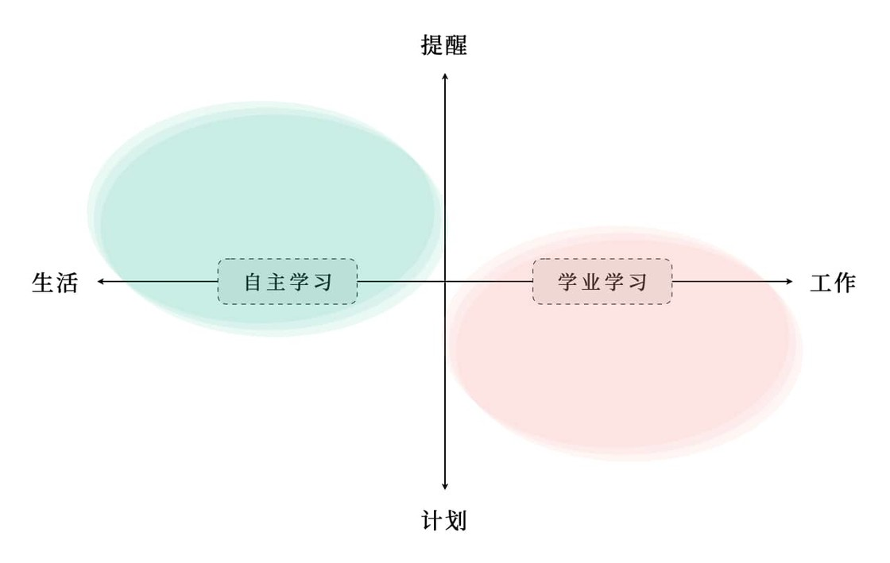
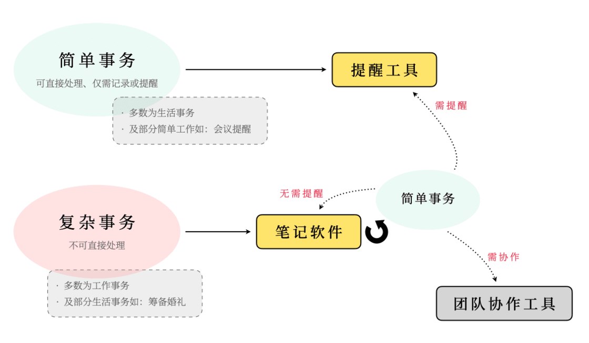
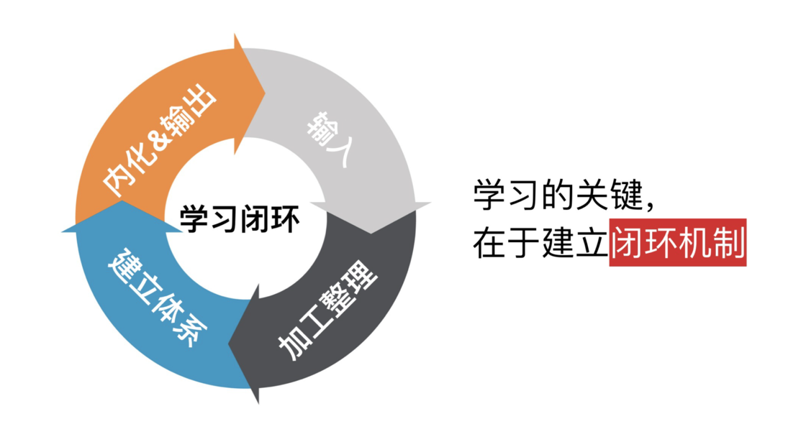
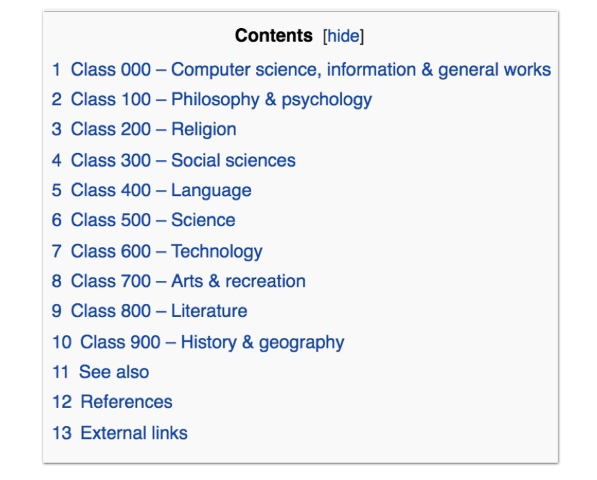

# 时间管理&笔记习惯养成

## 时间管理大师的工具

### 场景：解决什么问题？

>   时间管理是通过计划和有意识地控制在特定活动上的时间花费以提升效率的一个过程——维基百科

放到具体场景中来看，要处理的事情无非工作、生活两块

而时间管理工具能帮我们解决的问题也是两块

1.   提醒（不要忘记做某件事）
2.   计划（把大的内容拆成许多小的步骤去执行）



把时间管理工具的使用场景、及其提供的功能价值交叉，可以得到一个矩阵（如上图）

这张图上标记了两块区域，分别对应「生活提醒」与「工作计划」

代表时间管理工具适用场景：

-   生活事务（提醒更重要）

    一般都是可以直接行动的事情，不需要拆分计划

    >   如每月还信用卡、周五跟朋友看电影等

    简单录入一条提醒即可满足需求

-   工作事务（计划梳理更重要）

    往往不具备直接执行的条件，需要拆分计划

    >   不需要提醒，工作不按时完成，老板、同事一定会不停督促你，甚至拿钉钉这样的变态工具滴滴你

总而言之

-   在工作场景中，我们需要的是能辅助我们思考并寻找任务最优可执行路径的工具

-   在生活场景中，我们需要的则是一个简单易用的提醒工具


### 方法

市面上有很多时间管理方法

-   GTD

    完整的 GTD 方法包含收集、厘清、组织、回顾、执行 5 个环节，每个环节又包含进一步的细分流程或原则

    >   适合极度严谨精密之人
    >
    >   冗长的流程设计消耗了使用者过多心智

-   番茄工作法

    -   以每 25 分钟为一个番茄时间，作为一个不可分割的工作单元
    -   番茄时间不能被中断（如果中断就废弃掉重新开始）
    -   每个番茄时间后，短休息 3~5 分钟
    -   每 4 个番茄时间后，长休息 15~30 分钟

    >   适合自制力不足之人
    >
    >   不要被事情推着走，要学会如何推着事情走，不然你迟早淹没在做不完的事情里，且产出低效

-   Time-Boxing

    为计划事项预分配固定的时间段（即 timebox），并在 timebox 限定时间内完成计划事项

    >   不适合打工人
    >
    >   层级越高、占有资源越多的人越会拥有更多的时间支配主动权，越是底层劳动者就越难掌控自己的时间

-   四象限

    -   重要且紧急的事情：立即亲自动手完成，如：突发危急事件、临近截止日期事件
    -   重要不紧急的事情：设定完成日期并亲自完成，如：锻炼身体、拟定规划等
    -   不重要但紧急的事情：委托他人代办，如：无关紧要的电话、会议
    -   不重要不紧急的事情：移除不做，如：刷剧、玩游戏

    >   不适合打工人
    >
    >   衡量一件事情应该归属于哪个象限并不容易，且会带来额外的精力耗散

    >   可能压根就不存在紧急且重要的事情，应该多关注那些看似不紧急但却能给人带来真正长远价值的东西，比如：读书、锻炼身体


### 工具

目前主流工具以清单类和日程类为主，部分会集成如番茄钟、四象限之类的功能

这部分主要关注清单、日程在产品形态上的差异

笔记似乎不常被归入时间管理的范畴，但在「在工作场景中，我们需要的是能辅助我们思考并寻找任务最优可执行路径的工具」的前提下，笔记天生适用于这个需求


#### 待办清单与日程

-   清单以事务为导向（我有什么事情要做）

    ✅ 简单易用，便于随手记录

    ❌ 没法扫一眼就搞清楚接下来哪天有空、哪天要做哪些事情，缺少全局的「时间感」和控制感

    >   这就像很多人使用待办清单，打勾上瘾。甚至事情都已经处理完了，还要补录一条待办打上勾。这时 App 再识趣的来上一句「今天完成了 9 条任务，同比提升 20%，环比提升 35%」，就更难免觉得自己效率爆表了。
    >
    >   可任务内容天差地远，工作量甚至完全不在一个量级上，这样的统计能有什么意义？

-   日程以时间为导向（在特定时间段内我要做什么事情）

    ✅ 什么时间做什么事情一目了然

    ❌ 维护起来太麻烦，失去了清单的灵活性

    >   字节跳动张一鸣试过将一天的时间切割成小块，精准地去完成时间表中的每一项计划。经过反复实验，他发现这样做的效果不佳


#### 笔记

❌ 对时间管理而言，如果你单纯把着眼点放在「时间」上，那笔记显然不是一个合格工具

✅ 如果透过个人时间管理，看见其「效率提升」这个本质目的（尤其在工作场景下），那么笔记软件就是当之无愧的无冕之王


所有非笔记类都有一个共同点——过于结构化

1.   无法很好地承载原始信息
2.   对原始信息做结构化加工的过程中起不到辅助作用


比如 Boss 的一句工作任务，简单粗暴，只有只言片语的工作要求

我们需要通过信息搜集、任务拆分等手段，转化为结构清晰的步骤，然后动手去做


如果使用待办或日程，大多会需要提供包含标题、日期、时间、重复、提醒在内的诸多结构化信息

但我们大脑的思考活动却是一个连续的过程，且对于困难问题，需要反复推演才能得到一个有价值的结果

虽然这个结果本身往往是结构化的，但获取这个结果的过程一定是连续的、需要反复推演修正的


所以，这些结构化工具的正确使用方式应该是作为个人工作结果的承载（及再加工）

而笔记才是最能从根本上辅助我们提升工作效率的产品形态


#### 最佳组合阵容

基于以上分析，我们可以试着搭建一个个人时间管理的最佳工具组合



如图所示，一个简单易用的**提醒工具**，加上一个趁手的**笔记软件**就能很好的满足个人的时间管理需求

-   对于可以直接处理，仅需要记录或提醒的简单任务

    录入任何一个你喜欢的提醒工具即可

-   对于复杂任务

    录入笔记软件做进一步的加工，直至拆分成一组可直接执行的、定义明确的简单任务

    拆分之后：

    -   需要多人协作的，录入相关系统
    -   不需要协作的则可以根据需要录入个人清单或日程工具


### 溯源：掌控时间的终极法门

让我们再回过头来看维基百科对时间管理的定义：时间管理是通过计划和有意识地控制在特定活动上的时间花费以提升效率的一个过程

追本溯源，如何「控制在特定活动上的时间花费」才能最大限度的「提升效率」呢？

>   更大的效率来自于重要事情上做得好，而不是在处处做得好，管理精力比管理时间更重要。——张一鸣

>   我有两类问题，紧急的和重要的；紧急的都不重要，重要的也从不紧急。——艾森豪威尔

>   一般成功的人士和非常成功的人士之间的区别就在于，非常成功的人士几乎对所有事情都会说「不」。——巴菲特

道理很简单，**「不做事」一定是最节省时间、最高效的做事方式，学会「做重要的事」才是掌控时间的终极法门**

任何工作法、工具的定位都只能辅助我们做重要的事

认识到这一点，即便你不使用任何工具和花里胡哨的方法，也能高效管理自己的时间

**切忌成为本末倒置的效率工具控**


强烈推荐所有人听听这段 TED 演讲

[TED: How to Gain Control of Your Free Time?「TED：如何掌控你的空闲时间」](https://www.bilibili.com/video/BV1vx411e7Pg/)

借用演讲里的一句话：

>   「我没有时间」的意思通常是「那不是我的首要任务」。


## 打造笔记系统

Why?


收集而来的只会吃灰，只有真正记录下的才属于自己

>   「**菜**」，是客观物体，「**美**」，是主观感受。只有经过鼻子闻、经过口腔触、经过舌尖尝、知其历史、晓之文化、有己感悟，菜才能成为「**美**」食。

**尝试一下，从今天开始，不收集他人，只记录自己。**


### 记录啥？

-   Aha 时刻

    突然明白的一些事物、发现了意义所在、看到了前进的方向

    >   啊哈～我明白啦～

-   灵感

    人生中的每一个灵光乍现

    >   想要睡着的第一步便是假装睡着zzz

-   顺藤摸瓜

    当写灵感 1 的时候，冒出了 2 和 3，赶紧记录下来

    >   它不断给你藤，让你有的顺，然后在后面再给你一个大瓜

-   情绪

    客观记录，不批判好坏，只是自己的所想、所思，以便更深地认识自己

-   学习笔记

    避免碎片化学习，建立知识体系，知识会更加牢固，轻松地接纳更多知识

    >   把新乐高块收集到盒子里，则它们是「一盘散沙」，没成结构，没成「晶体」，并很快就会丢失，知识很快会遗忘

-   新式收藏

    不搬运，不收藏，只原创，用自己的话写笔记

    >   记录越简单，提取越困难；记录越困难，提取越简单。

-   多元思维

    记录不认同的事，争取让自己达到多元化思维

    >   同时保有两种截然相反的观念还能正常行事，这是一流智慧的标志。——菲茨杰拉德《了不起的盖茨比》


### 不要当囤囤怪

**完成从「收藏夹」到「阅读列表」的转变**

盲目收集各种资料，来者不拒，只是在满足自己的[松鼠心态](https://wiki.mbalib.com/wiki/松鼠症 "松鼠症")，99% 的概率你不会再看它

一篇好文的核心内容不超过20%，甚至能浓缩成一句话

用自己的话复述这些话，或用「葱鲔火锅笔记法」写下评论，反手删除之

这样写笔记，就已经战胜了 99% 的「知识搬运工」

>   博物馆的物品叫收藏，等奶茶的人叫队列。
>
>   **收藏夹的终点是留存，阅读列表的终点是清空。**
>
>   等奶茶的队列清空了，钱才会到手，好文亦然。


### 精简之美

这一种文字的「断舍离」哲学

**笔记是写给未来的自己的，所以重要的不是文采，而是记录翔实、用词明确和索引清晰**

不舍得删照片的人，自己也大概率不会去相册欣赏照片，因为里面充斥着各种冗余和杂乱

有句话：如何用最快的方式成为摄影师？删掉 100 张照片里的 99 张，你马上就是摄影师

同理，删掉 1000 字中的 900 字，你立刻就是写作高手了

废话少了，笔记就精华了，好**找**，也好**读**

如何精简呢？有个段子：如果不知道怎么删自己的稿子，就自己花钱打电报给出版社


### 从自制力到肌肉记忆的进化

人生笔记，记录的是人生，这就要求我们**持续不断**地记录

让自己持续做一件事，有两种方式，一种是自制力，一种是习惯

二者有本质不同，前者需要动用心智资源，后者则不需要

心智资源是可消耗资源

做什么都容易放弃的人，并非缺乏自制力，而是缺乏自制力的管理能力，他们会随意地浪费自己有限的自制力，直至自制力被琐事消耗光，却不能坚持成大事

**保护自制力资源，把坚持交给习惯**

有的人在地库里还打方向灯，我们要向他学习，他开车时不会随意浪费有限的心智资源，打方向灯、看后视镜、系安全带等事情都不用过脑，所以他持续开车很轻松

把习惯练到「肌肉」，无意识时，很多事已经被「肌肉」做掉了

譬如刷牙，小时候，我们需要动用强大的意志力让自己刷，甚至还要动用鸡毛掸子，但现在，梦游时也能把牙刷了

记笔记亦要如此，看到一件事，下意识点开记录界面


### 定期Review

我们过去的思考，已经成了我们最宝贵的财富

千万不要当傻财主，不知道自己家有什么宝藏，不知道宝藏在哪里

我们的笔记也遵循艾宾浩斯遗忘曲线规律，一周后，记忆中笔记的留存率只会剩下20%。我们需要让短期的思考，刻在自己漫长的人生道路上

如何记住笔记？艾宾浩斯告诉我们，最重要的方法，就是review


### 遇见更好的自己

**笔记的目的不是记忆过去，而是改变未来**

**笔记是思考，还能倒逼思考**

两个人的文摘是相同的，但没有任何两个人的笔记会相同，因为笔记承载的是你的思考、你的性格，你独特的人生

我们的思维是碎片的，唯有笔记，才能留存快照、积少成多、零存整取，也能让碎片知识建成体系的大厦，这里强调的是「唯有」

**这就是我们努力了那么多，却依然没有自己体系，思维仍然是一盘散沙的原因**

你读自己过去的笔记时，常会有这样的感叹，哇，那时的我就会这么想。日本一位著名医师说过一句话：我终于意识到，原来漫漫人生，最不了解的竟然是自己

这也是书写人生的笔记的魅力：**认识自己、了解自己、改变自己**


## 方法论

### 学习笔记 - INKA 笔记体系



-   Inbox：输入

    消息来源的中转站（比如备忘录）

-   Note：加工

    将中转站的信息加工成笔记

-   Knowledge：整理

    将做好的笔记整理到知识库

    **杜威十进制编码系统**

    

    分为三级，父子孙，对应百分位，十分位和个分位

-   Apply：输出

    素材的积累是输出的前提，形式不限，改到自己愿意读为止


### 摘抄笔记 - 复述

看一遍，合上书，用自己的话复述下来

复述的不像，不要紧，要紧的是，它现在已经开始真正属于你了


### 摘抄笔记 - 葱鲔（wěi）火锅笔记法

抄好句子，下面用自己的话写句评论（Kindle 做的笔记好像也是这个方法）

这样一段摘抄，一段评论，交替进行，其关系就像葱鲔火锅里鱼和葱的关系一样

```
			葱鲔火锅式读书笔记
日期
书名
作者
⭕️摘抄
⭐️评价
```

不知道怎么写评价的话，就一句话回答「你为什么要摘抄这个句子？」


### 费曼技巧

>   用自己的、简单的话来解释，说给门外汉听懂

浓缩成一个词就是「说人话」

1.  **明确目标**，明确你要学习的目标和内容，你到底在学什么东西，学的什么概念
2.  **以教为学**，要用自己的话，说出自己对知识的理解
3.  **总结提炼**，把复杂事情变简单


## 工具推荐

-   系统自带备忘录做 Inbox，可以全家桶设备同步
-   Typora 做笔记，整理 Inbox 中的待读项
-   做的笔记可以通过各大云盘同步


**道法术器，器最次之，有一颗记录的心，才是道**


[1]: https://sspai.com/post/88812	"从零开始：打造高效个人笔记系统的指南 - 少数派"
[2]: https://sspai.com/post/57493	"如何建立一个闭环的笔记体系？高效输入和输出的方法"
[3]: https://sspai.com/post/61776	"我们究竟需要怎样的时间管理工具"


