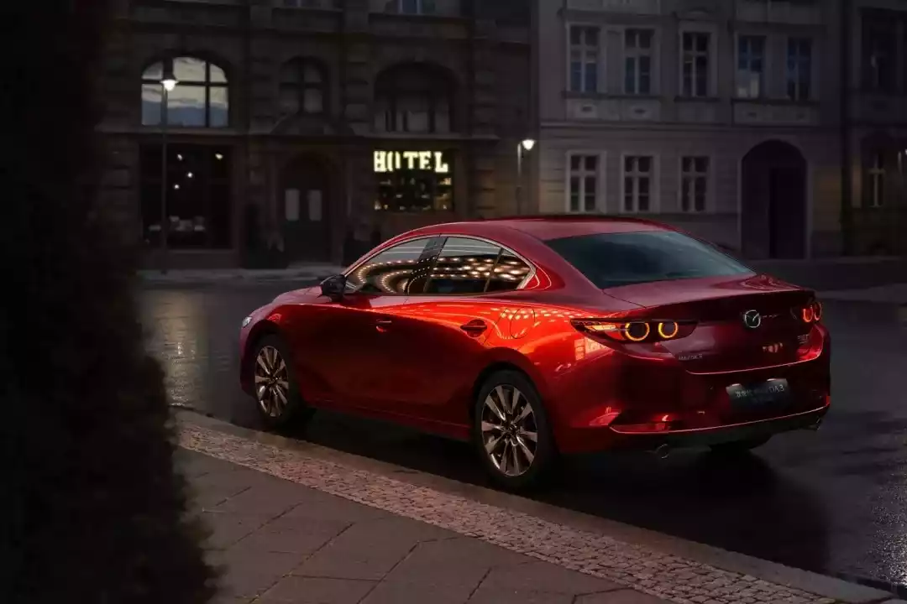

# 前言

作为一名驾驶爱好者，有生之年终于迎来了自己第一辆车的选购，当然是既紧张又激动啦~

本篇将复盘自己购车的整个历程，于我而言是一个人生重要的里程碑；于大家而言，更是很好的一个反面教材（Emm，实践是检验真理的唯一标准，实操过程中还是踩了不少雷……）

废话少说，让我们现在就开始吧~

# 选车篇

本篇主要从能源入手，先找到自己想要的**能源**类型，然后拿几个不同的**车型**做对比，看准后再挑想要的**配置**

切记，一切都是根据**需求**和**预算**，以及**喜爱程度**来的

## 能源

> 你需要根据需求、预算以及个人喜好，决定想要购买汽车的能源类型

既然要买车，你考虑好现在要买什么类型的车吗~燃油车？电车？

目前郭嘉大力推广政策补贴，行业正处于燃油车、电车过渡的阶段，所以在二者之间，有各种各样的混动类型，刚入门的小白肯定要看花眼，我这里简单介绍一下：

| 类型     | 补能  | 牌照 | 搭配              | 驱动                       | 备注                     |
| -------- | ----- | ---- | ----------------- | -------------------------- | ------------------------ |
| 燃油     | 油    | 蓝牌 | **发动机**        | 发动机                     | 可靠稳定，家庭的第一辆车 |
| 油电混动 | 油    | 蓝牌 | **发动机+微电池** | 发动机、电机、**共同驱动** | 丰田 Top1，巨省油        |
| 插电混动 | 油/电 | 绿牌 | **发动机+小电池** | 发动机、电机               |                          |
| 增程     | 油/电 | 绿牌 | **发动机+中电池** | 电机（发动机仅充电）       |                          |
| 纯电     | 电    | 绿牌 | **大电池**        | 电机                       | 适合通勤，天天开         |

- 其实各种混动和电车的差异主要就在于**搭配的电池容量大小**上

- **油电混动只加油无需充电**

  搭配了一个很小的动力电池，可以在起步或者低速时用电，电量耗尽时使用发动机充电，以达到省油的目的，还可以**一起发力**或者二者灵活切换

  > 首选**丰田双擎**系列的车型，可以说是天才般的设计，全球热销，稳定可靠

- **插电混动**是搭配两套动力系统，但是来回切换使用，要么发动机要么电机驱动

  而**增程**汽车则是仅靠电机驱动，发动机只负责充电

混动原理图如下，本田（HONDA）对应插电混动；丰田（TOYOTA）对应油电混动；日产（NISSAN）对应增程

具体选购哪种能源类型，没有绝对的好与绝对的坏，一定是看自己的需求，以下仅列举对应类型的**核心问题**：

- **燃油车：是否接受颗粒捕捉器？**

  传统油车，发动机国外技术领先。为了实现汽车工业弯道超车，郭嘉就换赛道大力推广国产电车，有两大好处：

  1. 一个是可**扶持本国汽车产业，带动经济复苏**
  2. 另一个是**减少传统燃油汽车合资企业的市场**

  既然要减占燃油车市场，就会出台对应的政策来进行限制，例如提高年审标准的 [OBD](https://baike.baidu.com/item/%E8%BD%A6%E8%BD%BD%E8%87%AA%E8%AF%8A%E6%96%AD%E7%B3%BB%E7%BB%9F/11046661) 检测；提高排放要求的[国 6B 排放标准](https://baike.baidu.com/item/%E5%9B%BD%E5%AE%B6%E7%AC%AC%E5%85%AD%E9%98%B6%E6%AE%B5%E6%9C%BA%E5%8A%A8%E8%BD%A6%E6%B1%A1%E6%9F%93%E7%89%A9%E6%8E%92%E6%94%BE%E6%A0%87%E5%87%86/17664910#:~:text=%E5%9B%BD%E5%AE%B6%E7%AC%AC%E5%85%AD%E9%98%B6%E6%AE%B5%E6%9C%BA%E5%8A%A8%E8%BD%A6%E6%B1%A1%E6%9F%93%E7%89%A9%E6%8E%92%E6%94%BE%E6%A0%87%E5%87%86%E6%98%AF%E6%8C%87%E4%B8%BA%E8%B4%AF%E5%BD%BB%E3%80%8A%E4%B8%AD%E5%8D%8E%E4%BA%BA%E6%B0%91%E5%85%B1%E5%92%8C%E5%9B%BD%E7%8E%AF%E5%A2%83%E4%BF%9D%E6%8A%A4%E6%B3%95%E3%80%8B%E3%80%8A%E4%B8%AD%E5%8D%8E%E4%BA%BA%E6%B0%91%E5%85%B1%E5%92%8C%E5%9B%BD%E5%A4%A7%E6%B0%94%E6%B1%A1%E6%9F%93%E9%98%B2%E6%B2%BB%E6%B3%95%E3%80%8B%EF%BC%8C%E9%98%B2%E6%B2%BB%E5%8E%8B%E7%87%83%E5%BC%8F%E5%8F%8A%E6%B0%94%E4%BD%93%E7%87%83%E6%96%99%E7%82%B9%E7%87%83%E5%BC%8F%E5%8F%91%E5%8A%A8%E6%9C%BA%E6%B1%BD%E8%BD%A6%E6%8E%92%E6%B0%94%E5%AF%B9%E7%8E%AF%E5%A2%83%E7%9A%84%E6%B1%A1%E6%9F%93%EF%BC%8C%E4%BF%9D%E6%8A%A4%E7%94%9F%E6%80%81%E7%8E%AF%E5%A2%83%EF%BC%8C%E4%BF%9D%E9%9A%9C%E4%BA%BA%E4%BD%93%E5%81%A5%E5%BA%B7%E8%80%8C%E5%88%B6%E5%AE%9A%E7%9A%84%E6%A0%87%E5%87%86%E3%80%82,%E5%8C%85%E6%8B%AC%E3%80%8A%E8%BD%BB%E5%9E%8B%E6%B1%BD%E8%BD%A6%E6%B1%A1%E6%9F%93%E7%89%A9%E6%8E%92%E6%94%BE%E9%99%90%E5%80%BC%E5%8F%8A%E6%B5%8B%E9%87%8F%E6%96%B9%E6%B3%95%EF%BC%88%E4%B8%AD%E5%9B%BD%E7%AC%AC%E5%85%AD%E9%98%B6%E6%AE%B5%EF%BC%89%E3%80%8B%E5%92%8C%E3%80%8A%E9%87%8D%E5%9E%8B%E6%9F%B4%E6%B2%B9%E8%BD%A6%E6%B1%A1%E6%9F%93%E7%89%A9%E6%8E%92%E6%94%BE%E9%99%90%E5%80%BC%E5%8F%8A%E6%B5%8B%E9%87%8F%E6%96%B9%E6%B3%95%EF%BC%88%E4%B8%AD%E5%9B%BD%E7%AC%AC%E5%85%AD%E9%98%B6%E6%AE%B5%EF%BC%89%E3%80%8B2%E9%83%A8%E5%88%86%E3%80%82)

  排放标准的提高，也就要求**发动机优化出更高的效率，以减少废气排放**。而大多数厂商短时间内没有技术或没有计划去做发动机的更新换代（因为油车没人给补贴，徒然增加成本了），**图省事就安装一个颗粒捕捉器**，相当于给汽车戴口罩，虽然能够快速应对排放标准，但是**会造成堵塞问题，导致油耗升高、动力下降**。

  典型的丰田双擎 23 款车型之后都加装了颗粒捕捉器，这个东西换一个也不便宜（5k-1w），私自拆卸影响年审，算是一个比较闹心的问题，如果介意的话，可以着重关注不带颗粒捕捉器的车型

- **电车：有条件安装家用充电桩吗？**

  - 没有的话，附近能解决充电问题吗？
  - 如果附近充电桩离家比较远，能否接受下雨往返不便的问题？

  城市里安装家用充电桩，还需要有固定停车位，并且小区物业同意才能安装，那一个固定车位的价格可能都让人望尘莫及了

  并且，在外面充电的话有以下几个问题：

  1. 商业电价波动

     **峰谷电价导致用车成本优势下降**，燃油车一般 0.5 元/公里；电车**家用电价**一般 0.05 元/公里；外面**商用电价** 0.13 元/公里（1 元一度电），0.26 元/公里（2 元一度电）

     甚至部分地区现在开始收取**服务费**，等到各种基础建设配套完善后，倘若停止补贴，那么使用成本将会回归市场价值

  2. 不省心

     车开回来还得去附近充电桩充电，然后走路、骑单车回家？外面的充电桩有的本身是一个停车场，可能充电仅前两小时停车免费，那回家吃完饭之后还得赶过来挪车，遇到下雨天或者停车位都不好解决的情况下简直就是灾难

  何况现阶段，电车主打中高端市场，续航长一点的电车售价远高于降价的油车，中间的差价都足以油车加个好几年的油了

  况且油车可以长时间存放，电车存放也会慢慢亏电，得天天开才好哦~

- **插电混动本质是伪需求？**

  能解决充电问题当然可以选大容量的纯电车，否则插电混动当电车开还是会面临上面两点问题。纯当油车开而不充电，会导致更高的油耗，况且两套系统带来更高的维护成本，那这样为什么不直接买台皮实耐造的油车？

因此，不同能源对应不同的使用场景，你可以借助这个表格，方便找到合适自己的类型

| 能源类型 | 使用场景     | 备注                     |
| -------- | ------------ | ------------------------ |
| 燃油     | 长途         | 续航长、加油方便         |
|          | 高速         | 性能稳定、省油           |
|          | 长期吃灰     | 发动机不会放坏           |
|          | 极热极寒     | 不会大幅衰减性能         |
| 纯电     | 有家用充电桩 | 唯一先决条件             |
|          | 通勤         | 堵车不会增加油耗         |
|          | 城市道路     | 城市补能方便             |
|          | 智能化       | 见仁见智                 |
| 混动     | 综合         | 集燃油、纯电的优点与缺点 |

我自身选择的油车，可能一部分受到汽车文化的影响，更加钟情于传统的内燃机一点

每每踏下油门，发动机的轰鸣和怒吼仿佛化身一头野兽，跟随着我的狂热一同汹涌澎湃，进而在喧嚣的世界迸发出最强的生命力，人马合一~

说白了就是纯粹的喜欢哈哈哈哈哈，并且结合一点现实因素：

1. 没有充电环境，不方便充电
2. 平常不怎么开，买回来吃灰，电车存放会亏电
3. 燃油车皮实耐造啊，开个 10 年发动机正值壮年，寿命以 20 年记（~~老伙计~~）

   电车电池寿命可能 5-10 年，到时候电池健康度就只剩 60-80% 了，换电池可能都是汽车本身的价格（忍痛）
4. 燃油没有续航焦虑，剩余里程为 0 时，油箱里的底油还能开 100km

   电车必须预留 20% 的电量用来找充电桩，否则最后一点电量完全耗尽就真的馈电了
5. 加油一分钟，充电半小时
6. 湖北冬冷夏热，极端气温条件下，电池性能会下降
7. 有跑高速的需求

所以，电车还有待观望，抛开智能化、冰箱彩电大沙发等家用体验外，其稳定性也需要不断迭代、提升

倘若有一天，军队都能配备电车，便是电池技术拥有了质的飞跃，这就没有理由不认可了

## 车型

> 你需要根据需求、预算以及个人喜好，决定想要购买汽车的车型

### Mazda MX-5

My dream car is Mazda MX-5 Miata

眼馋ing~

之前一汽马自达引入国内过，后来因为定价离谱（国外 12w RMB，国内 30w RMB），销量惨淡匆匆下架（狗看了都摇头）

因此，全国内保有量极少（限量 500 台），目前只能依靠平行进口或者看看二手车

让我们一睹 miata 的美颜吧~

<iframe src="//player.bilibili.com/player.html?isOutside=true&aid=884494199&bvid=BV1RK4y1h7z1&cid=232044133&p=1&autoplay=0" scrolling="no" border="0" frameborder="no" framespacing="0" allowfullscreen="true"></iframe>

同时，也是 [@极速拍档-小乔](https://space.bilibili.com/18154819) 的座驾：

<iframe src="//player.bilibili.com/player.html?isOutside=true&aid=224665724&bvid=BV1Db411X7Ru&cid=1017316206&p=1&autoplay=0" scrolling="no" border="0" frameborder="no" framespacing="0" allowfullscreen="true"></iframe>

这里是这辆享誉全球的 mini 敞篷跑车的趣味起源：

<iframe src="//player.bilibili.com/player.html?isOutside=true&aid=920013637&bvid=BV1gu4y1n7Fz&cid=1311117252&p=1&autoplay=0" scrolling="no" border="0" frameborder="no" framespacing="0" allowfullscreen="true"></iframe>

### Mazda 3 Axela

> 喜欢这辆车的车主，同级别可能就不会考虑其他车型了

这一款是我购买的车

废话不多说，放个视频欣赏先~

<iframe src="//player.bilibili.com/player.html?isOutside=true&aid=621941594&bvid=BV1Zb4y1L7t3&cid=1358776258&p=1&autoplay=0" scrolling="no" border="0" frameborder="no" framespacing="0" allowfullscreen="true"></iframe>

无论是外观惊鸿一瞥，亦或是动漫《头文字D》中高桥兄弟的转子绝唱。马自达总归是特立独行，在这个大众主流的车企里显得格格不入

就是有一股子的顽固劲儿，对于驾驶的理解，对于美学的钻研，只是吸引小部分喜欢它的群体（只要全球占有率达到 2% 就算成功），独有自己作为小众品牌的生存之道

这一点跟相机中的富士，有着异曲同工之妙啊！作为上个世纪的胶片厂，在数码时代独守自己的 APS-C 画幅和胶片模拟作为卖点，在索尼佳能尼康三巨头下夹缝生存哈哈，牢牢占据自己的小众市场份额

那么现在正式开始彩虹 p，有其他爱车请手动略过~

先讲**外观**，外观设计是这辆车最大的特色，最新一代的**魂动设计**语言，配上**加长的车头**，显得无比优雅、年轻

2020 年发布以来，入围「世界年度车」大奖三强，并斩获「世界年度设计车」大奖、德国红点设计大奖「至尊奖」

**前车灯【天使之眼】**，**后车灯四圆环**，马路上实属罕见哈哈（怎么有点碰瓷 GTR 的感觉？）

发动机方面，我选的那款是 **2.0L 自然吸气发动机**，最大功率为 116kw，最大马力为 158hp，最大扭矩 202 N·m，放在家用车上，带**重量只有 1385kg** 的轿车，妥妥够用辣~

> - 2.0L 是**排量**，相当于汽车的嘴巴，数字越大，空气吸入越多（暴风吸入~），动力越强
>
>   家用车排量大概就在 1.0L - 2.5L，现在普遍为 1.5L 和 2.0L
>
>   再大的排量一般会出现在美式肌肉车上（大排量后驱车）
>
> - **功率**为性能指标，功率越大，汽车的性能越强
>
> - **马力等同于功率**，只是单位不一样，可以像成一匹马的能力，讲究的是谁跑得快
>
>   `马力 = 功率 x 1.362`
>
>   **现代汽车通用国际单位单位是功率**而不是马力
>
> - **扭矩是汽车的力量**，可以参考一头牛的能力，讲究的是谁负重能力强
>
>   功率和扭矩其实是一个东西
>
> - 关于**功率和扭矩的关系**如下
>
>   `功率 = 扭矩 x 发动机转速`
>
>   发动机转速就是类似于自行车踏板，一分钟转多少圈
>   
>   不好记的话可以类比为：
>   
>   `总伤害 = 攻击力 x 攻击速度`
>   
>   所以汽车都会标注：
>   
>   | 最大扭矩转速 | 最大功率转速 |
>   | ------------ | ------------ |
>   | 4000         | 6000         |
>   
>   可是为什么最大扭矩在 4000 转就达到了呢？
>   
>   这就好比骑自行车的踏板速度，踏板速度过快，就感觉踩空了使不上劲儿~但是也能提高功率

并且 2012 年就上市的代号「创驰蓝天 G 发动机」，就已经**满足 2023 年的「国 6B」排放标准**，而隔壁丰田家的解决方案就是加颗粒捕捉器。。。（颗粒捕捉器的危害见能源章节）

很多人会有疑惑，明明数据没有 1.5T 这种涡轮增压的发动机数据好看，你在这吹的这么厉害

> 1.5T 是指排量为 1.5L 的发动机，同时加装一个**涡轮增压器（Turbo）**
>
> 相当于给发动机这个嘴巴加上一个呼吸机，强行将空气灌入到嘴里，以压榨性能
>
> 缺点就是【涡轮迟滞】：增压器启动会有延迟，带来的结果就是深踩油门需要等待延迟之后才能爆发性能

No No 哦~这两种类型的发动机发力方式不一样哦

- 自然吸气：类似于直男，说啥是啥，**油门踩多少，速度就提升多少**
- 涡轮增压：类似于渣男，**气氛一到，速度瞬间飙升；但气氛未到时，动力较弱**

自然吸气的好处就是加塞小王子，有人想要变道加塞，能够**精准给油瞬间提速**，阻挡住前车

此时换成涡轮增压要么给油**涡轮延迟**中，没力气跟不上，被别人加塞；要么一下涡轮生效，**瞬间动力过强**，以至于车辆窜了出去，造成追尾

并且涡轮车因为多一个结构的原因，维修成本也会提升啦~

>   需要知道的是，汽车的最高速度跟加不加涡轮没啥关系，涡轮的作用是缩短汽车到达最大功率的时间，能够更快地使出全力
>
>   而最直接影响急速的东西是排量，并且还得考虑到车重、发动机调教等原因，参考如下
>
>   | 项目             | 马自达3 昂克赛拉 2023款 2.0L 自动质耀版 | 思域 2025款 240TURBO CVT 智趣Plus | 小米SU7 2024款 后驱标准长续航智驾版 |
>   | ---------------- | --------------------------------------- | --------------------------------- | ----------------------------------- |
>   | 最大功率（kW）   | 116（158 Ps）                           | 134（182 Ps）                     | **220（299 Ps）**                   |
>   | 最大扭矩（N·m）  | 202                                     | 240                               | **400**                             |
>   | 重量（kg）       | 1385                                    | 1356                              | **1980**                            |
>   | 最高速度（km/h） | **213**                                 | 200                               | 210                                 |
>
>   电车因为电动机的特性，扭矩天生较大，因此功率也更高（还记得扭矩和功率的公式嘛？`功率 = 扭矩 x 转速`
>
>   但是因为电池导致车重过大，因此最高性能其实受限，很多电车几乎都去掉备胎以减轻负重

况且别忘了，这辆车其实也有采用「创驰蓝天 X 发动机」的版本，也就是压燃版，同样是 2.0L 发动机，直接能够爆发出 180Ps，230 N·m 的性能，可谓是将自然吸气发挥到了极致！缺点就是贵哈哈😭

>   没错，马自达就是这么偏执。。。

扯远啦扯远啦~

小马 **6AT 手自一体变速箱**，被调教的非常聪明，以至于不需要所谓的【运动模式】，无论踩下油门的幅度深浅，都能够瞬间理解驾驶者的意图，积极地降档拉高转速，以达到最大性能，体验下来真的是酣畅淋漓

>   甚至 AT 变速箱一般在更高的价位才回投入使用，就是因为成本高
>
>   而这个价位的 AT 变速箱轿车好像就只有四个。。。

维修成本除了 MT（手动挡）以外，也算是最实惠的啦~，寿命也比 CVT 的长

> | 变速箱类型          | 特点                               | 缺点                                       |
> | ------------------- | ---------------------------------- | ------------------------------------------ |
> | 手动变速箱（MT）    | 有力、省油、好玩、便宜好修         | 复杂、难开                                 |
> | 自动变速箱（AT）    | 简单、轻松、稳定、耐造             | 不如 MT 有力、成本高、响应慢               |
> | 双离合变速箱（DCT） | 结合了MT/AT的优点、换挡快          | 早期易过热、结构更为复杂、低端车型可能顿挫 |
> | 无级变速箱（CVT）   | 变速比连续可变、换挡平顺、结构简单 | 承受扭矩有限、加速感不直接、磨损快、维修贵 |

提到了变速箱，**油门踏板**也有特色，采用风琴式踏板，连接到底盘，并非普通的悬挂式

这样能够更加精准地控制油门开度，以及长途踩油门可以歇歇脚哈哈

> 一般跑车才会配备这样的设计

甚至将油门踩到低，最后还留有一个开关，这是小马的**鸡血开关**（Kick-Down），无论当前档位、速度如何，只要踩入这个段落，变速箱都能降到极限档位，转速直接攀升 6000 转红线，带来最强功率输出！！！（冲鸭！！！）

还有一个在实际驾驶中能够明显感知到的东西，就是**可变助力转向系统**

这个会在低速时，让方向盘更加轻盈好转，而高速时增加重量，带来更稳定的驾驶手感

方向盘后面其实还有两个更少见的配置——**换挡拨片**！

能够更加自在地体验手动驾驶的乐趣（我自身也是手动挡出身嘛）

可不是摆设！这玩意儿降档能降到齿轮打齿，拉转速能拉到红线，可见一斑

>   一般也是在跑车上才配备这一项，而马自达这样仿佛在说：哎～就是玩儿～

**声音方面**，根据测试结果还是比较静谧的，2000 转以下不觉得有什么噪音

到 2000 转以上的话，发动机的声音开始逐渐躁动；3000 转以上有所声响；4000 转以上就迸发轰鸣

我看过这个车相关的构造，好像在车身结构上，刻意有让中高转速发动机的声音传递到驾驶舱的设计哈哈哈哈哈

声浪调教的还是很好听的，但是这样的设计算是自嗨行为了吧哈哈哈

> 马自达的快是快乐的快哈哈哈哈哈

以操控著称的马自达，**底盘的调教**也非常棒，汽车整体性很好，转向能够抑止驾驶者的侧倾，让姿态保持直立

**安全性**也是我考虑的范畴，不过在此不多赘述，马自达的车身一直属于日系车里 t0 的级别，卡罗拉、雷凌、轩逸可能是别人的吸能盒。。。怎么说呢，不怕车祸撞别人，就怕别人追尾被创飞~

其他方面，我在开的过程中体会到，**发动机启停和自动驻车**这两个功能，被调教的真的好用！

> - 发动机启停
>
>   刹车刹停后自动熄火省油，松开刹车踏板自动点火，但是伤电瓶，相当于用电瓶换油耗
>
> - 自动驻车
>
>   刹车刹停后，自动把车定住，不用拉手刹、挂 P 档

举个例子，别的车可能刹停之后直接触发发动机启停，如果红绿灯只有十几秒，那没一会儿就又要启动发动机，有点伤电瓶，得不偿失了

而马自达的刹车，轻踩刹停，只会触发自动驻车，此时不用挂空档，相当于发动机自动拉了手刹，而重踩才会触发启停，这也就意味开的过程中能够随心所欲的控制这两套机制

更神奇的是，当你要别车，打了方向盘之后，自动启停和自动驻车会默认给你关掉哈哈哈

**起步的过程中也不用刻意拉手刹**，挂 D 档给油就走，手刹是自动解除的

并且**停车挂 P 档熄火，手刹会自动启动**，妈妈再也不用担心我没拉手刹了！

总结一下：

| 刹车力度 | 是否触发自动驻车 | 是否触发启停 | 点火方式 | 起步方式 |    你的脚    |
| :------: | :--------------: | :----------: | :------: | :------: | :----------: |
|    轻    |        ❌         |      ❌       |  未熄火  |  松刹车  | 不要离开刹车 |
|   适中   |        ✔         |      ❌       |  未熄火  |  踩油门  |     随意     |
|    重    |        ✔         |      ✔       |  踩油门  |  踩油门  |     随意     |

- 系统默认开启启停、关闭自动驻车

  若未开启自动驻车，踩下刹车踏板触发启停之后，松开刹车踏板则自动点火

还有几个小细节点，就是车窗支持遥控钥匙控制，这个一般车企不会配备，因为还要考虑防夹功能，成本就上来了

不过 22 款 - 23 款后悬挂有所减配，原因其实是最令人诟病的后排空间问题

这款车的驾驶位可以说是 VIP 位置，**一切为了驾驶而生**，其次是副驾。后排放到同级别的家用车里，优点捉襟见肘了，减配的目的也是为了增加一点后排空间

> 我朋友虾虾说后排空间还不错？？？
>
> 他说比我这更小的都见过

虽然减配实锤，但是也不输于使用独立悬架，却调教不好的车型，并且一定程度提高了点后排空间大小，也算是向家用市场做出了妥协

> 减配也能降点价格哈哈哈

其他的普遍反馈的声音大的问题，见仁见智，都说了本质上属于驾驶者之车，突出一点发动机的声浪，我觉得好听，网友会觉得声音太突出隔音效果不好哈哈哈

总之，这个价位这样的调教，已经算是打磨的非常精致了，还不够？那你加预算哈哈哈

很多大厂车企光靠堆料解决的问题，在小厂面前无法倾斜资源。但正是这样马自达不服输的转子精神，固执又专一，专注自己所认为的人马合一的理念，无疑深深的吸引了我这个 2% 的信仰用户~

### 一些题外话

这款车型真的只是纯纯契合于我

你要说没有新能源汽车的冰箱彩电大沙发，屏幕大、车机更智能，那这也是这个品牌在国内买不动的原因

因为这些都是所谓的家庭需求，SUV 车型才是最契合本土需求的车型

载人空间比轿车大，过烂路凑合越野车，出去旅行后备箱赛皮卡……

典型的干啥啥都行，中规中矩，优点都有缺点也都包含

况且国内并不太有所谓的汽车文化，对于大众而言更多的是一种作为从 A 到 B 的交通工具

在这个家用轿车手动挡都要灭绝的时代，在这个燃油车都要被赶走的时代，马自达能够这样纯粹

这像极了我们每一个普通人，还拥有一颗不曾愿意妥协于生活的心

>   Zoom-Zoom
>
>   所有的孩子生来就知道它。
>
>   只有少数人长大后还记得它。
>
>   唯独有家汽车公司从未忘记它。
>
>   在成人的语言里，它用来表达极端动感带来的愉悦和释放。
>
>   然而，事实上，却只有孩子们才真正理解了它，他们只是简单地说：“去玩Zoom-Zoom 吧”。
>
>   而我们每一天都在实践它。
>
>   因此，我们才能制造出此时此刻呈现在您眼前的这辆汽车。
>
>   Zoom-Zoom
>
>   今天我们把它从您心中唤醒了吗?

这是每一本马自达汽车说明手册上第一页都会有的一首小诗，只有孩子才能真正理解的快乐～

也是我没有向现实妥协，坚持想要的车

一辆车，首先得是辆车，首先得是辆下车后会让人回头看两眼的车，首先得是辆坐在驾驶位挂档开转向灯瞅准时机送刹车踩油门开出去后能感受到快乐的车，首先得是一辆自己花了钱后感觉“这钱花的真值”的车

不然只能叫载着人的四个轮子

希望你也能找到属于自己的汽车～

## 配置

> 你需要根据需求、预算以及个人喜好，决定想要购买汽车的配置

关于我的 23 款昂克赛拉

**最低配手动挡**，只能我开 pass（况且这年头，手动档只有思域动力给的足）

**自动挡质悦与质擎**同价，但前者有天窗、后者有 2.0L 发动机，当然是要发动机

**顶配质尊**多了：钢琴黑车门饰板、白色精致镀铬内饰装饰、HUD投显、自动防眩目内后视镜、车内空气过滤器（PM2.5）、白色真皮座椅、前驻车雷达、360度全景影像驻车辅助系统、FCTA 前方横向来车预警系统、SBS-R 智能倒车刹车辅助系统(正后方)、SBS-RC 智能后车盲区刹车辅助系统(侧后方)、马自达车机

太贵了pass

最后仅列举我心目中的决赛圈：

| 项目                   | 质擎                                               | 质炫                                                         | 质雅                               | 质耀                                       | 质臻           |
| ---------------------- | -------------------------------------------------- | ------------------------------------------------------------ | ---------------------------------- | ------------------------------------------ | -------------- |
| 指导价                 | 9.99w                                              | 11.29w                                                       | 11.59w                             | 11.99w                                     | 12.29w         |
| 经销商价               | 9.79w (-0.20)                                      | 10.29w (-1.00)                                               | 10.59w (-1.00)                     | 10.99w (-1.00)                             | 11.29w (-1.00) |
| 购置税                 | 8,664                                              | 9,106                                                        | 9,372                              | 9,726                                      | 9,991          |
| **落地预估（含保险）** | 11.23w                                             | 11.78w                                                       | 12.12w                             | 12.56w                                     | 12.89w         |
| **差异额**             |                                                    | +13,000 +5,000（优惠后）                                  | +3,000                             | +4,000                                     | +3,000         |
| **差异项-外观**        | **轮胎**规格 205/60 R16 **外进气格栅**哑光  | **轮胎**规格 215/45 R18 **外进气格栅**钢琴黑 自动**头灯** **后视镜**电动折叠、电加热、锁车自动折叠 电动**天窗** 雨量感应**雨刷** |                                    | **明选包** **后视镜**记忆、倒车自动下翻 |                |
| **差异项-内饰**        | 黑色哑光**装饰** **中控台饰板**哑光            | 黑色镀铬**装饰** **中控台饰板**激光双层 **真皮**方向盘、换挡把手 方向盘**换挡拨片** 双区独立**空调** 主副**化妆镜灯** | **真皮**座椅                       | 主驾**电动座椅**、腰部支撑、座椅记忆       |                |
| **差异项-其他**        |                                                    | 定速**巡航** 前排无**钥匙**进入、四门车窗升降 **选装**明选安选 | **选装**明选安选 **选装**黑曜版 |                                            | **安选包**     |

- 购置税 = 购置价 / (1+13%) x 购置税率(12%)
- 明选包3000：侧后方倒车预警系统、BSM盲点监测系统（并线辅助）、LED日间行车灯（尾灯组）
- 安选包4000：MRCC 全速域自适应巡航系统、LDWS 车道偏离警示系统、LAS 车道保持辅助系统、SBS 智能前行刹车辅助系统、HBC 自适应远光灯控制系统、CTS 巡航模式智能行车辅助系统
- 黑曜版1000：亮黑运动轮毂 、亮黑后视镜 、勃艮第红真皮座椅丨精致红色缝线
- 颜色：铂刚灰2000、水晶魂动红3000

### 补充说明

- **质擎**是性价比之王！不接受反驳，16 寸的轮毂便宜耐造，一条只要 400，而 18 寸的要 800，那个胎壁还很薄，低胎压容易破；有没有天窗也因人而异，天窗更敞亮，但是老化后有漏水的可能（不省心）
- **自动头灯**行驶过程中默认不能关哈～只能调光线灵敏度
- **感应雨刷**感觉最低档也太灵敏了，哈哈哈体验中规中矩
- **无钥匙进入**太舒服了，钥匙直接揣兜里全程不需要拿出来，摸摸门把手感应开门关门，然后感应到钥匙在车内直接可以点火，下车再也不怕忘了拿钥匙啦～

  或者感应到人离开了车辆，可以自动帮你落锁
- **明选包**是精髓，附带以下：
  -   侧后方倒车预警：就是倒车雷达 plus 版，横向来车会提前提醒，感觉有点过于灵敏了哈哈
  -   并线辅助：巨好用的功能，后视镜会有个三角形，侧后方有车会亮黄灯，如果此时向那个方向打转向灯，会直接报警提醒
  -   车灯：前车灯「天使之眼」，后车灯「四圆环」，还有日间行车灯，是小马的灵魂所在
- **安选包**看人，我不想自动驾驶，且现阶段自动驾驶都不好用，撞到人了车企也不负责，顶多说自动刹车用上一次就回本哈哈
- **电动座椅**感觉不如手动的快～
- **全系配置 CarPlay**，不用担心车机过时或者 cpu 算力不够导致的卡顿
- **真皮座椅**对象很喜欢，其他车型很少标注真皮，要么混合要么人造。。。
- **车载音响**虽然有 8 个，但是音质我总感觉不够好？
- **油耗**的话，日系车普遍还好，我这个平常高架 5.8 了都（开巡航模式更省油），高速一般 120 - 150，油耗上到 7.2 了
- **后排有出风口**
- **物理按钮**可以盲操
- **发动机仪表盘**是我爱的机械式三环运动仪表盘
- 车内有**能补光的化妆镜**哈哈
- **有倒车雷达**。。。说的就是你本田丰田，有的车型没有雷达只有影像，真的很无语！
- 担心开不好车？自带**人马一体评价系统**，教你怎么驾驭小马～
- **黑耀版**很帅啊！！黑色轮毂、黑色后视镜、酒红色座椅
- **颜色**的话混蛋红、洗车灰要加钱哈哈哈，**珍珠白**不加钱其实很赚，别的一般珍珠白加钱

  原因是汽车底漆的颜色其实是近似黑色，但是珍珠白会在表漆面中加入云母一类的材料，模仿出贝壳一样的光泽，相当于增加了成本哈哈，所以一般这种珍珠白的车会比纯黑的车贵
- 。。。（想起来再说）

# 试车篇

看中了某款车或某几款车，可以去**经销商**处**看看实体车**，务必**试驾/试乘**一下，觉得有意向可以让销售**算算价格**，心里有个数，也方便去其他经销售猛猛砍价

## 经销商

> 你需要查看官网或者地图，找到要去拜访的经销商
>
> 可以提前做背调，查口碑，这样可以有不同的策略，比如口碑差的猛猛砍价，探这款车的底价，口碑好的让他多赚点，可托付信任

### No.1 [武汉龙泰](https://baike.baidu.com/item/%E6%AD%A6%E6%B1%89%E9%BE%99%E6%B3%B0%E6%B1%BD%E8%BD%A6%E9%94%80%E5%94%AE%E6%9C%8D%E5%8A%A1%E6%9C%89%E9%99%90%E5%85%AC%E5%8F%B8)

> 售多市 400-666-2747 武汉东湖高新技术开发区光谷一路207号（高新大道与光谷一路交汇处）
>

湖北国企，综合卖多个品牌的汽车，所以只有一层展厅

我就是选的这一家，销售亲和力很好，而且很懂这个品牌

### No.2 [武汉龙泰元](https://baike.baidu.com/item/%E6%AD%A6%E6%B1%89%E9%BE%99%E6%B3%B0%E5%85%83%E6%B1%BD%E8%BD%A6%E9%94%80%E5%94%AE%E6%9C%8D%E5%8A%A1%E6%9C%89%E9%99%90%E5%85%AC%E5%8F%B8)

> 售本市 4008307602 武汉市洪山区雄楚大街430号
>

武汉龙泰的子公司，相当于是专门成立的一个马自达专营 4s 店，规模很大，很好看

这个销售会更实诚一点，报价比龙泰那个要更爽快，所以预测利润空间大很多（但是我用来比价哈哈哈，因为龙泰那个销售太有亲和力了）

### No.3 [武汉银马](https://baike.baidu.com/item/%E6%AD%A6%E6%B1%89%E9%93%B6%E9%A9%AC%E6%B1%BD%E8%BD%A6%E9%94%80%E5%94%AE%E6%9C%89%E9%99%90%E5%85%AC%E5%8F%B8) 🙅‍

> 售本省 400-125-5952 武汉市汉阳区黄金口金色环路18-3马自达4s店
>

不推荐，口碑不行，新闻如下：

[武汉银马强烈投诉20160514最新进展](https://bbs.pcauto.com.cn/topic-11234908.html)

[马自达武汉银马欺诈消费者购车‼️](http://xhslink.com/a/Rpjgwkud2uQX)

## 看车

> 你需要找一家 4s 店看看实体车咧~

好好看、好好开~

### 参观

把车车当一匹骏马，去看（外观）、去抚摸（漆面光泽）、坐上去体验一下（内饰氛围）

可以想想自己的关注点或者需求，带着问题，和销售聊一聊

### 试驾

可以的话去尝试试驾，如果没有太多的驾驶经验就选择试乘，从乘客的角度感受一下乘坐体验

如果自认为是老司机，或者有一定的驾驶经验，有过某一辆车的驾驶手感，则试驾可以从以下几个方面动态来对比考核一下（直线、弯道、路况、稳定）：

1. 在安全的情况下，加速到一定速度，然后踩死刹车，直到完全停止，看**车头点头现象**严不严重

   > 好的底盘能比较好地抑制点头，将刹车力更多地分配给后轮

2. 在无人空旷的地方，保持一定的速度，做**蛇形运动**，或在转弯的时候稍稍改变打方向盘的幅度，看车身的响应速度

   > 可以试出方向盘的虚位大小，家用车的虚位一般以3-5°比较好
   >
   > 虚位太小方向太灵敏，可能导致直线开不直，要不停地修正，很累也危险；虚位太大，则方向很模糊，不利于精确控车

   快速蛇形（等于在绕桩），还能感受底盘支撑的软硬抓、地力强弱（轮胎对抓地的影响也很大）、方向盘轻重（转向手感）

3. 在熟悉的路段仔细体会，看在不同路面（粗、细柏油，粗、细水泥，积水，有沙子、碎石的路面）方向盘和座位是否有不同的反馈

   > 这一点见仁见智，有的人喜欢直接的反馈，晚上看不清的情况下通过底盘的反馈可以判断是柏油路还是水泥路，路面是不是有砂石，以估算刹车距离会延长还是缩短；有的人则不喜欢过于细碎的反馈

4. 有条件的话，快速通过弯道处的减速带，测试底盘的响应速度和抓地，如果感觉车尾外甩明显，则抓地较差，车尾外甩不明显，则抓地较好

   > 一般独立后悬挂的抓地会好于扭力梁后悬挂的车，但也不绝对，多试几种不同车就会有体会

### 沟通

可能会遇到销售问的几个问题：

1. 销售问：你是第一次来看车吗

   新手：是的，给我介绍一下吧

   高手：你家是第一次来

   > 暗示已经了解过别家，不要忽悠我，直接谈价格

2. 中意哪一款车型

   本意是给你介绍、推荐，确认预算和需求，按照实际情况回答即可

3. 什么时候有意向购车

   判断你的购车意愿，越早销售**积极性**越强，大概在月内为一个分界线（因为汽车价格、优惠变化幅度太大）

   汽车销量与节假日需求有关，可参考如下节点：

   - **2、3、4 月**过完年，**5 月** 4s 店接收新订单，需要去库存：**销售淡季**
   - **6、7、8、9 月**销量持续上升，直到 **10 月**国庆节达到顶峰
   - **11、12、次年 1 月**，年前刚需，车企冲销量

   

4. 销售问：打算贷款还是全款

   新手：贷款吧，压力小一点/全款吧，省事

   高手：都可以接受，帮我都算算，看哪个划算

   > 不要直接说全款，销售一听分期提成没了，立即变脸；也不要直接说贷款，销售知道你预算不充足，分期方案忽悠你，推荐利息高的他提成更高

## 算价格

> 你需要开始坐下来谈价格了
>
> 买不买都行，只要不付定金，价格都可以一直磨，到处去问

看实车挺合适，试驾也挺满意，就可以开始算价格了，这个是让销售初步给你计算一下购车明细

切记，一定要坐下来正式地谈，口头上问到的价格一定只是最基本的价格

一定要让销售列清楚价格明细，出库费、服务费等不该出的费用一分不要出，如果贷款买车列清楚首付、月供、利息和费率等

### 落地价格细则

全款 = 裸车价 + 购置税 + 保险 + 上牌

贷款 = 裸车价 + 购置税 + 保险 + 上牌 + **贷款利息**

| 项目             | 计算方法                     | 签订方   |
| ---------------- | ---------------------------- | -------- |
| 裸车价           | 开票价                       | 4s 店    |
| 购置税           | 裸车价 / 11.3                | 交管所   |
| 保险（含车船税） | 购置税 x (0.35~0.45)         | 保险公司 |
| 上牌费           | 交管所 120，4s 店 500        | 交管所   |
| 贷款利息         | 贷款金额 x 年费率 x 贷款年限 | 银行     |

- ⚠不合理费用不必出：装潢费、出库费、GPS 费、PDI 费、服务费、手续费

### 谈判与技巧

#### 锚定效应

利用锚定效应，让自己的出价成为初始锚点，占据主导权

让销售按照你的条件砍价，而不是你按销售给的优惠往上抬，让销售便宜点

> 锚定效应是指：在不确定情境下，人们在进行数据判断估计的时候会受到最先获得的数值，就是“初始锚”的影响
>
> 以初始锚作为参照点，进行不断地调整并做出最后的估计，最后的判断估计结果会偏向初始锚的一种判断偏差现象

#### 4S 店组织架构

`销售员—主管—经理`，各级别能够拿到的优惠标准是不同

比如销售员优惠的最大的幅度是 3000，那主管就可能是 5000，经理就可能是 8000

各级有各级的限制，要是超过这个幅度，就要向各自的上级请示

#### 车展订车

第一天属于媒体日，消费者没有办法进入

第二天车展才正式对外开放，不要着急

等到车展最后一天，并且快要结束时才去找销售订车

> 这时销售们看见客户两眼都会冒光，感觉像看救世主一样，这种心情只有当过汽车销售的人才知道

### 赠品

价格真的谈不下来，多要一些赠品，要好的，例如：**加油卡、保养卡、玻璃贴膜（这个可能有雷，见后文）、行车记录仪、脚垫、底盘装甲、灭火器**。挂件、香水、抱枕、方向盘套等劣质的不推荐

之所以把**玻璃贴膜**单独拿出来讲，是因为这里有雷

玻璃贴膜我觉得算是一个**比较重要的汽车配件**，一个是黑色玻璃可以**提升隐私性**，另一个是湖北的夏天很热，紫外线很强，贴一个**抗热抗紫外线**的玻璃膜很大程度提升车内的体验，比如酷暑的夏天，进车不会很烫、空调效果提升，并且不用担心紫外线晒伤

>   注意，玻璃贴膜是指玻璃上的贴膜，不包含汽车的车衣，汽车车衣因为最低的成本比较贵，所以一般不会送

但是！现在的 4s 店会把这个外包给第三方贴膜商，提完车后会安排第三方的贴膜客服找你预约贴膜（注意，非官方），然后去了会给你说：送的膜不太行，推荐各种贴膜套餐，他们的产品效果有是有，就是价格不够透明

这个其实是第三方贴膜商找 4s 店买的客源，免费贴膜的成本是贴膜商的，赚的就是你额外花钱购买的付费产品，并且 4s 店还会拿提成，可见汽车行业水有多深

综上，送的玻璃贴膜不要抱太大期望，原因我也说了，这是一个比较重要的汽车配件，贴第三方贴膜商免费送的膜，可能就只有墨镜的效果，车内透光率很差，晚上都看不清楚后视镜了（哭），而且劣质膜太阳晒过可能还会有味道，并且撕掉可能还会留胶

一想到这些，送的膜我觉得干脆还是不要贴的好，**要么就是让 4s 店贴，要么自己找一些靠谱的贴膜店（龙膜什么的）**，起码市场认可度高，且明码标价，比什么都强！

## 砍价教学

> 请带一名异性以便应对销售人员
>
> 在选择销售人员时尽量选择男性
>
> 男人一般容易冲动、爽快，女人就比较斤斤计较点，谈到最后肯定费力
>
> 女顾客砍男销售肯定有天然优势，男顾客要是砍女销售，那就难咯！

1. 等销售员

   到了 4S 店后可以先看看车，在样车内坐坐，等销售员过来找你

2. 表诚心

   先和销售员聊聊车，并表示出你很喜欢这车

3. 了解优惠价格

   了解优惠价格，留下联系方式，去其他经销商逛逛

   > 留意销售服务态度，门店运营情况

   **决定买继续再往下走**

4. 坐下谈

   火候差不多时，可以要求大家坐下来谈谈价格

   一般地，坐下后销售会拿出张表来帮你算各项价格

5. 砍价格

   以心里预期价位为锚点，预估优惠价、行情价、底价

   **请直接砍净车价**

   > 价格分为以下四块，净车价、购置税、保险、上牌、~~贷款利息~~
   >
   > 购置税与保险是与净车价直接挂钩的，净车价砍下来了，税和保险都要重新计算

   以下话术层层递进

   

   **第一轮：优缺点**

   露出失望的神色，表示这个价格还是离你的心理价位有一定的差距

   然后和他聊聊这车的缺点，以及其它竞争车型的优点，暗示他要是实在谈不下来只能去别家店看看了

   这时和你一起来的人唱红白脸

   > 比如男的说实在谈不笼要去别的地方看看，女的就要表示其实自己挺喜欢这车的之类的理由，让男的欲走还留，让销售觉得煮熟的鸭子要飞了

   

   **第二轮：暗示定金**

   要是价格合适可以交定金，让他去请示领导

   请示归来后，你会发现价格下来好大一快，似乎已经到自己心理价位

   先别惊喜，很多人到这一步就准备签合同了，千万忍住

   这个价很可能还不是他领导同意的最低价，销售一般会给自己留余地，现在砍价战斗才真正开始

   

   **第三轮：立马交钱**

   继续作出比较遗憾的神态，但是要很真诚的安慰对方，告诉销售：你的态度服务很好，我们很感动，出于对他的信任，我们告诉你我们的心理价格

   > 这时销售的报价可能已经在你心理价格以下，那我们就在他的最低价上再砍去个1000～2000

   很大度的对他说，我也知道你很为难，要不你再请示一下你们领导，要是可以我们立马交钱。这时一般销售会再次给领导电话的，请示的结果要是满足了你的报价，那恭喜了，你成功了

   要是没有达成你的要求，比如不能再便宜或者只能再便宜 500

6. 关于赠品

   千万不要将砍价与赠品混在一起谈

   销售说价格谈不下来，可以多送点东西

   > 赠品不值钱，那些都是小事，一带而过就好了，到最后再和他好好磨

   技巧就是磨，赠品不看数量看质量

7. 关于保险

   与4S店以返利的形式挂钩，4S店做保险一般不超过7～8折，如果超过了，跟他砍

8. 关于购置税

   总价降低，购置税也要降低

9. 关于上牌

   要跟4S店敲定上牌就是全包，（牌照的框架和车管所的停车费）

10. 后戏

   套近乎，建立感情，表示感谢对方的良好服务，态度很好，要介绍亲朋好友也来买之类的

   > 人家被你砍的血淋淋的，说几句热乎话安慰下，也显得咱人品好嘛

   以后保养的时候，大家熟了好办事

买卖交易，讲究个缘分，实在谈不笼也别争个脸红脖子粗的，要保持风度是不？买了车后期保养维护理赔之类的不还是要来吗？大家搞僵了对你自己也没好处嘛

再说人家销售也是打工混口饭吃，砍价不是砍人，语气态度很重要，也别太为难人家了

# 购车篇

价格算好了，决定买了，就可以先付下**定金**，到时候有现车或者到了交车日期，得**工作日请一天假**（因为交管所周末不上班），跑过来**提车**，分为以下几个关键步骤：

- 验车
- 签购车合同付尾款（或者到银行去贷款）
- 开发票上保险
- 缴税上牌
- 清点资料

## 定金

> 算的价格感觉合适了，就可以考虑购车，支付定金
>
> 定金可以作为砍价的手段之一哈~

定金是为了促使购车合同的签订的，你可以交了定金之后再签合同，你保证要买这辆车，车企保证帮你保留车

法律上，定金应该签定金合同，且定金不可退

定金合同上，**一定要仔细确认，是否跟谈判说的一致**，以及各种赠品都得写上，避免销售的口头承诺

> 注意：如果是贷款，可能存在银行贷款不通过的情况，就是你交了定金，但是银行贷款不通过，则没办法支付车款
>
> 担心此风险需考虑定金合同的相关事宜

最后按照合同约定金额付款，4S 店支持刷卡转账现金三种方式

- 刷卡一般要求只能免费刷 1-2 次，超过可能会收取手续费，储蓄卡 20 元封顶。刷信用卡无论多少笔都要收取手续费，各银行费率不同，一般在万元 48-55 之间
- 转账注意加上备注，例如：vv 马自达昂克赛拉23款，这样更有利于 4S 店查账
- 现金就不说了，提前清点好数目即可

另外注意些小套路：有些销售会制造阴阳合同，客户成交价是15.6万，和公司汇报15.5万，如果销售以各种理由要求一部分车款进他个人账户，先不要声张，等刷完应付款项再慢慢和他清算价格是否有问题

签完之后，就代表你预定了这辆车，请等待车厂生产交车，或者有现车直接进入下一环节吧~

## 验车

> 有现车，或者到了交付日期，就到了提车环节

请仔细检查你的爱车，**未验车前请不要付清尾款**，验车时应在光线充足的环境下，光线不足可以用手机自带的 LED 手电筒补光，验车时主要检查以下几个项目：

1. **检查漆面有无明显划痕**（尤其黑色漆面特别明显）

   如划痕伤及底漆（露出白色金属部分）建议更换车辆或者要求一定补偿。细微划痕一般是擦车洗车时，毛巾上有沙子造成的，一般抛光能解决没必要深究

   另外刚洗完车一定要擦干水渍再验车，因为水渍会起到遮掩效果

   顺便教大家一个判断是否重新喷漆的简单办法：用手背感受漆面，如感觉漆面发涩，不顺滑，很有可能是补过漆，这种感觉和原厂漆有很明显的区别

2. **检查生产日期**

   生产日期在车身铭牌处，一般在副驾驶A柱下方

   业内把 3 个月内的叫做近期车，6 个月以上称为库存车，但这种说法只针对热门品牌

   > 库存车可以砍价

3. **检查轮胎及各种随车工具**

   轮胎在商品车上来说不属于易损件（玻璃同理），极少存在被调换的情况。所以没必要趴在地上一个个看生产日期，注意检查是否漏气、破损、磨损程度即可

   随车工具一般包括：千斤顶、套筒、拖钩、三脚架、反光背心、备胎（有些车型没有）一般情况下不会遗失，有即可

4. **检查公里数**

   100 公里内都不必太过纠结，从生产线上下来到大库-大库到中转站-中转站到 4S 店，除去板车运输的路程，势必会产生一些公里数。有些寸土寸金的大城市，4S 店和仓库之间隔着 10 多公里都是常有的事

5. **检查发动机**

   发动机属于传动系统中最为关键的部分，是出厂检测的重中之重，有问题 99.9% 的情况下在工厂就已经解决了。所以我们检查发动机是否有明显杂音和异常抖动即可，没必要大力轰几脚油，除了听个响没任何效果，更没必要带上听诊器，尺子之类的物品……

   另外有些全铝发动机表面会产生白点，这是正常的氧化作用

其他的一般没问题的话都还好，因为汽车会有 3 年 / 10w 公里的质保，没必要太过紧张

至此验车完毕，进入下一个环节

## 贷款

> 验完车就可以付钱了
>
> 好好研究你的贷款方案

全款购车直接支付尾款即可，可跳过本小节

### 方案

贷款就是借钱买车，可以找以下三家：

1. ✔**银行贷款**（利息低）
2. ✔厂家金融（利息适中，如有活动较划算）
3. ❌信用贷款（利息高）

**推荐银行贷款，利息低**

每个月**还款金额**包含两个部分：一个是找银行借的**本金**，另一个是银行收取的**利息**，贷款的还款方式有以下几种：

1. 等额本金：月还款金额递减，每月还款本金保持不变，利息逐月递减
2. 等额本息：月还款金额保持不变，每月还款本金逐月递增，利息逐月递减
3. **等本等息**：月还款金额保持不变，每月还款本金不变、利息不变

**汽车贷款中最合适的方案是等本等息**

因为 2 年提前还款，放到 5 年的时间跨度，一半都没有走到

其他两种方式是利息每个月递减的，且提前还款是只还剩余本金不用还利息

如果还款前期就出了利息的大头，岂不是已经让银行赚完啦？所以等本等息，每个月本金和利息固定是最适合提前还款的方式

**车企所谓免息的原理是什么？**

4s 店推荐买家给银行贷款，银行会给车企高额反点，所以你贷款买车，车企也会给你很多优惠，甚至提出**免息**，具体概念如下：

车企按照银行的政策，一般会推荐分 60 期，**2 年后提前还款不用支付违约金**，并且车企会把这**两年的利息钱全都帮你优惠到车价里**，这就叫 2 年免息

这样做有以下几个好处：

1. 车企完成银行任务，得到返点
2. **我们白嫖车企给的免息和优惠，并且因为车价降低，向交管所交的税也能少个几千块**
3. **我们可以找车企杀价，杀的狗血淋头**

仿佛只有银行受伤的世界达成了，，，

其实不然，银行这是通过概率论在赌，赌你 2 年后会养成每个月还款的习惯，继续还款，直到 5 年，如此一来，我们可能会多出 2-3w 的利息钱（大概贷款 7-8w）

所以，**签贷款合同时一定要注意以下几点：**

1. **等本等息**
2. **2 年后提前还款没有违约金**

记得定个提醒，两年后别忘了提前还款

### 计算公式

| 项目     | 计算公式                                |
| -------- | --------------------------------------- |
| 贷款利息 | 贷款金额 x 年费率 x 贷款年限            |
| 年费率   | 年利息 / 贷款金额                       |
| 月费率   | 月利息 / 贷款金额                       |
| 月供     | 贷款金额 / 贷款期数 + 贷款金额 x 月费率 |

- 此为费率而非利率，因为车贷一般等本等息，即每期还固定的本金和利息，利息并未因本金的增加而减少

  真实利率可以用 irr 公式计算

- 年费率正常情况下一般在 4.99%（常说 4.99 厘）

### 示例

买车首付 20%（裸车价 11.29w），3 年 36 期，年费率 4.93%

首付：11.29w x 20% = 2.29w

贷款：9w

- 年利息：9w x 4.93% = 4437
- 总利息：4437 x 3 = 1.3311w
- 月利息：4437 / 12 = 369.75
- 月本金：9w / 36 = 2500
- 月供：9w / 36 + 369.75 = 2869.75

## 保险

> 开了购车发票就可以买保险了
>
> 老司机可以酌情少买点~不放心就拉满~

**请核对购车的发票金额**，因为车损险的金额是根据发票金额来的

原则上车价部分付多少钱就开多少钱，低开购车发票会导致车损险额度也随之降低，到时候理赔金额会减少

### 保险公司

保险是交给保险公司的，全款买车可以自己找保险公司自己买，贷款买车一般需要在 4s 店提供的保险公司买

> 直接在 4s 买的保险，他们会有返利，你也可以要一点返点

至于买哪一家无所谓，便宜就行，常见的保险公司如下：

| 车险公司                                             | 成立时间            | 性质             |
| ---------------------------------------------------- | ------------------- | ---------------- |
| **中国人民财产保险股份有限公司（人保车险）**         | 1949 年 10 月 20 日 | 国有             |
| **中国太平保险集团有限责任公司（太平车险）**         | 1929 年 11 月 20 日 | 国有             |
| **中国平安保险（集团）股份有限公司（平安车险）**     | 1988 年             | 私有             |
| **中国太平洋保险（集团）股份有限公司（太平洋车险）** | 1991 年 5 月 13 日  | 国有             |
| 天安财产保险股份有限公司（天安车险）                 | 1995 年 1 月 27 日  | 私有（中外合资） |
| 永安财产保险股份有限公司（永安车险）                 | 1996 年 9 月 28 日  | 国有控股         |
| 华安财产保险股份有限公司（华安车险）                 | 1996 年 12 月 3 日  | 私有             |

- 国有企业赔付速度可能会比较慢，但是胜在靠谱

### 保险内容

| 项目                     | 说明                                                         |
| ------------------------ | ------------------------------------------------------------ |
| **交强险**               | 不属于商业保险，交管局规定必交，除此之外都是商业保险         |
| **第三者责任险**         | 赔偿对第三方造成的人身及财产损失**（赔别人/车）**            |
| **车辆损失险**           | 赔偿自己爱车损失的费用**（改革后细则见下表）（赔自己车）**   |
| **车上人员责任险**       | 赔偿车辆因交通事故造成的车内人员的伤亡的保险**（赔司机/乘客）** |
| 法定节假日限额翻倍险     | 在节假日（包括双休日）期间，三者险的保障翻倍                 |
| **三者不计免赔险**       | 车损险是自带不计免赔，第三者责任险根据事故责任比例设定了免赔额 |
| **医保外医疗费用责任险** | 比如骨折之类的治疗费，可能一大块不进医保，需要自掏腰包       |
| 车身划痕险               | 无碰撞痕迹的车身表面油漆单独划伤的损失                       |

| 车辆损失险           | 改革后细则                                                   |
| -------------------- | ------------------------------------------------------------ |
| 全车盗抢险           | 赔偿全车被盗窃、抢劫、抢夺造成的车辆损失                     |
| 不计免赔特约险       | 保险条款特别约定损失费用由保险公司将同样给予赔偿             |
| 自燃损失险           | 赔偿车子因自身原因引发火灾造成的损失                         |
| 车辆涉水险           | 爱车被水淹导致发动机受损所造成的损失                         |
| 玻璃单独破碎险       | 发生车窗、挡风玻璃的单独破碎损失                             |
| 无法找到第三方特约险 | 比如出门停车办事，回来发现车被他人损害；车辆驾驶途中被他人剐蹭，但是被他人逃逸 |

- 前三个为主要商业保险，覆盖全面，后面为部分高性价比的附加险种

- 第三者责任险我买的时候默认要 300w，可是我感觉用不到，软磨硬泡下调至 200w，听业务员的意思就是 10 个 300w 中才能有一个 200w 名额

- 业务员给我绑定了一个 400 多的套餐险，不让去掉，硬着头皮交了学费，，，

  明年不续费这个项目，应该会自动停保吧

- 保险不出险，每年会下调几百块哈

## 缴税上牌

> 交完保险就可以上牌了

我是直接在 4s 店上的牌，全程都有人带着做，所以步骤很简单，准备好资料后，交购置税、交工本费、就可以摇号了

> 自己上牌的话请查询交管所流程

我当时摇号忘了拍照，但是一眼看到了 `鄂A M4P90`，笑死我了这个，M4 是 [M4A1](https://baike.baidu.com/item/M4A1%E5%8D%A1%E5%AE%BE%E6%9E%AA/11016421) 的简称，和 [P90](https://baike.baidu.com/item/p90%E5%86%B2%E9%94%8B%E6%9E%AA/1885194) 一样都是一把枪的名字，好记又朗朗上口

年轻人对车牌号就没那么多讲究了，这里大概说下一些社会普遍会比较认可的点

- `鄂W` 是武汉的新号牌，但认可度小于 `鄂A`
- 纯数字的号牌保有量小于【验证码】号牌
- 大家喜欢 8，忌讳 4

流程走完后，会给你发一个临时牌照，正式牌照到时候会邮寄过来，不过也有几点注意事项：

- 临牌停车收起来可以规避电子眼，但是也有概率被现场贴罚单
- 正式牌照签收之后，需要 3 日内装上，否则属于违法行为，被抓到后果自负

  > “你这是违法行为，跟我走一趟”
- 临时牌照进出停车场其实不太方便

## 清点资料

> 最后一步，确认各种材料齐全

1. 使用说明书

2. 发票

   报税联，注册登记联

2. 行驶证

   汽车的身份证

3. 机动车登记证书

   俗称绿本，是汽车的户口本

4. 合格证原件

5. 环保标识

6. 其他贷款单、保险单（电子版）

确认无误之后就可以开走啦~

回家的路上请立即加油.jpg，起码加个 10L 以上

小心被加油站宰，加油站会看你是新车，让你加各种添加剂，别听他的

打开加油盖会有喷气现象，是正常的，因为汽车出厂就一点点底油，存放过后会蒸发，导致气压过大

其他的请自行参阅说明书手册哦，这个是最权威的教科书啦~

## 最终落地价细则

次世代 马自达3 昂克赛拉 23款

| 项目         | 数据                               |
| ------------ | ---------------------------------- |
| 原车价       | 11.99w                             |
| 砍价         | 2.6w（8k 两年免息，1.8w 现金优惠） |
| **裸车价**   | 9.39w                              |
| 押金         | 1w                                 |
| **首付**     | 1.88w                              |
| **银行贷款** | 7.51w                              |
| 分期         | 5 年 60 期                         |
| 费率         | 4.8%                               |
| **月供**     | 1552.07（本金1251.67 + 利息300.4） |
| 两年总利息   | 7.68k                              |

- 裸车价：9.39w

- 购置税：8309.74

- 保险：4539.57

  | 项目             | 保额   | 保费    |
  | ---------------- | ------ | ------- |
  | 车损             | 9.39w  | 1976.13 |
  | 三者             | 200w   | 990.82  |
  | 车上人员（司机） | 1w     | 26.96   |
  | 车上人员（乘客） | 1w * 4 | 69.29   |
  | 医保外费用       | 20w    | 33.37   |
  | 代收交强险       |        | 950     |
  | 代收车船税       |        | 35      |
  | 途顺家安组合     | 捆绑   | 458     |

- 上牌：660

  - 服务费 600
  - 工本费 60

- 两年还款利息：7.68k

- 贷款抵押金：1k

**落地价格：11.6w**

# 用车篇

> 此篇根据经验整理，会不断更新

## 保养

[保养计划表在线文档](https://docs.qq.com/sheet/DT3lEdkdOQ1dzQldh?tab=BB08J2)

- 新车走合之后，应该在行驶里程 5000km 以内接受免费保养

    超出该行驶里程的车辆将不能享受免费保养服务

- 最长保养间隔为 10,000 km 或 6 个月，以先到者为准

    如因未按照建议的方式进行维护保养而造成与之相关零部件损伤，将可能引起三包争议

- 三包有效期：2 年或 50,000 公里

- 包修期：3 年或 100,000 公里

### 正常行驶维修保养计划间隔清单

| 保养项目                               | 第1次                                     | 第2次 | 第3次 | 第4次 | 第5次 | 第6次 | 第7次 | 第8次 |
| :------------------------------------- | :---------------------------------------- | :---- | :---- | :---- | :---- | :---- | :---- | ----- |
| 发动机机油*1                           | R                                         | R     | R     | R     | R     | R     | R     | R     |
| 发动机机油滤清器                       | R per 1wkm/1y                             |       |       |       |       |       |       |       |
| 积碳清除剂*9                           | I per 1wkm                                |       |       |       |       |       |       |       |
| 火花塞*2                               | R per 12wkm                               |       |       |       |       |       |       |       |
| 空气滤清器                             |                                           | C     |       | R     |       | C     |       | R     |
| 传动皮带*3                             | I                                         | I     | I     | I     | I     | I     | I     | I     |
| 发动机冷却液液位                       | I                                         | I     | I     | I     | I     | I     | I     | I     |
| 发动机冷却液*4                         | R first 20wkm/10y after R per 10wkm/5y |       |       |       |       |       |       |       |
| 燃油输送管及软管                       |                                           | I     |       | I     |       | I     |       | I     |
| 排放软管和管道                         |                                           | I     |       | I     |       | I     |       | I     |
| 蓄电池*5                               |                                           | I     |       | I     |       | I     |       | I     |
| 燃油滤清器                             | R per 6wkm                                |       |       |       |       |       |       |       |
| 制动管路、软管及连接件                 |                                           | I     |       | I     |       | I     |       | I     |
| 真空制动助力器和软管                   |                                           | I     |       | I     |       | I     |       | I     |
| 制动和离合器液液位                     | I                                         | I     | I     |       | I     | I     | I     |       |
| 制动液*6                               |                                           |       |       | R     |       |       |       | R     |
| 盘式制动器                             | I                                         | I     | I     | I     | I     | I     | I     | I     |
| 轮胎换位                               | I per 1wkm                                |       |       |       |       |       |       |       |
| 轮胎充气压力和轮胎磨损*7               | I                                         | I     | I     | I     | I     | I     | I     | I     |
| 转向系统操作和连杆组                   |                                           | I     |       | I     |       | I     |       | I     |
| 前后悬架、球型接头及车轮轴承的轴向间隙 |                                           | I     |       | I     |       | I     |       | I     |
| 手动变速器油                           | R per 6wkm/3y                             |       |       |       |       |       |       |       |
| 传动轴防尘罩                           |                                           |       |       | I     |       |       |       | I     |
| 在底盘和车身上的螺栓和螺母             |                                           | T     |       | T     |       | T     |       | T     |
| 废气排放系统和隔热板                   |                                           | I     |       | I     |       | I     |       | I     |
| 车身状况 (锈蚀、腐蚀与穿孔)            | I per 1y                                  |       |       |       |       |       |       |       |
| 紧急爆胎修复工具套装 (若装有)*8        | I per 1y                                  |       |       |       |       |       |       |       |
| 车厢空气滤清器                         |                                           | R     |       | R     |       | R     |       | R     |
| 所有灯的功能                           |                                           | I     |       | I     |       | I     |       | I     |
| 用马自达模块化诊断系统 (MDARS) 自检*9  | I                                         | I     | I     | I     | I     | I     | I     | I     |

I: 检查: 检查和清洁、修理、调整、加注或需要时更换。

R: 更换

C: 清洁

T: 紧固

**备注**

*1 仅在使用 API SM (ILSAC GF-IV) 或更高规格的发动机机油时才实施此标准。无论是否显示保养信息/扳手指示灯，只要更换了发动机机油，就要复位保养监测系统。

*2 如果采用含铁量或含锰量较高的汽油，则应每 15,000 km 或 12 个月对火花塞进行一次检查，并在有必要时将其更换。

*3 还要检查空调装置的传动皮带 (如果已安装)。

*4 更换发动机冷却液时建议使用 FL-22 或FL-23。使用 FL-22 和FL-23 以外的其它发动机冷却液，可能会严重损坏发动机和冷却系统。

*5 检查蓄电池酸液液位、比重和外观。密封的蓄电池仅需外观检查。

*6 如果经常使用制动器 (例如，持续性的在恶劣条件或山区驾驶) 或者如果在非常潮湿的气候条件下驾驶汽车，则每年更换一次制动液。

*7 检查安装的备用轮胎。

*8 每年进行周期维护时检查轮胎修复液的有效日期。在有效日期前更换轮胎修复液瓶。

*9 如果读取到服务代码 P1200，必须添加长安马自达创驰蓝天发动机专用积碳清除剂。

- 使用非长安马自达创驰蓝天发动机专用积碳清除剂可能引起燃油系统故障。

### 机油参考

| 种类    | 长效性  | 粘度 | 价格 |
| ------- | ------- | ---- | ---- |
| 长城    | 5000km  | 中   | 319  |
| 出光    | 5000km  | 低   | 369  |
| 道达尔  | 5000+km | 中   | 438  |
| 港壳    | 1y      |      |      |
| 鹏斯PUP | 1y      |      |      |

### 燃油添加剂参考

| 种类           | 类型   | PEA 含量 | 使用                                                         |
| -------------- | ------ | -------- | ------------------------------------------------------------ |
| 雪弗龙特劲     | 清洁型 | 低       | 355ml的一次最好加两瓶或者两箱油连着添加，因为PEA含量低了 295ml或者470ml的3000-4000km加一瓶 |
| 芥末绿         | 养护型 |          | 100ml小铝瓶的适合每箱油都使用 400ml的3000-4000km加一瓶    |
| 红线           | 养护型 |          | 433ml的可以每箱油都添加100ml，也可以3000-4000km加一瓶        |
| 安索           | 养护型 |          |                                                              |
| HKS            | 养护型 |          |                                                              |
| 途虎金虎液     |        |          |                                                              |
| 老李化学一箱清 |        |          |                                                              |

## 保险

[保养计划表在线文档](https://docs.qq.com/sheet/DT3lEdkdOQ1dzQldh?tab=BB08J2)

每年缴纳一次，连续未出险保费会下降

### 保险出险流程

## 年审

[保养计划表在线文档](https://docs.qq.com/sheet/DT3lEdkdOQ1dzQldh?tab=BB08J2)

10 年以内：第 2 年和第 4 年在线领取电子版合格标志，第 6 年和第 8 年进行线上检验

超过 10 年：1 年检测一次

超过 15 年：半年检测一次

## 洗车

我是自己手洗，武汉可以去【一洗来】自助洗车点，洗车流程如下：

1. 先打泡沫，挂留掉表面的沙尘

   直接上高压水枪，冲走的细沙会容易刮花漆面

2. 高压水枪冲走泥土

3. 泡沫枪打满

4. 擦洗汽车

   建议买那种洗车拖把

5. 高压水枪冲走泡沫

6. 擦干汽车

   建议买小辫子收水毛巾

7. 用海绵打蜡

   一圈圈画圆，涂满整个车漆部分

8. 用干毛巾擦干蜡

   擦完善良如新

# 附录A 小马零部件价格

| 备件名称                | 单位 | 价格                                      |
| ----------------------- | ---- | ----------------------------------------- |
| 长城机油（0W20 4.2L）   | 瓶   | 319                                       |
| 长城机油（0W20 1L）     | 瓶   | 76                                        |
| 出光机油（0W20 4.2L）   | 瓶   | 369                                       |
| 出光机油（0W20 1L）     | 瓶   | 88                                        |
| 道达尔机油（0W20 4.2L） | 瓶   | 438                                       |
| 道达尔机油（0W20 1L）   | 瓶   | 109                                       |
| 垫片                    | 个   | 5.9                                       |
| 机油滤清器（国产/进口） | 个   | 38.7/48.7                                 |
| 燃油滤清器              | 个   | 485.21                                    |
| 空气滤芯                | 个   | 73                                        |
| 空调滤芯                | 个   | 60                                        |
| 防PM2.5空调滤芯         | 个   | 199                                       |
| 防冻液                  | 瓶   | 119                                       |
| 燃油添加剂              | 瓶   | 107                                       |
| 节气门清洗剂            | 瓶   | 177.3                                     |
| 三元催化清洗还原        | 瓶   | 171.9                                     |
| 空调制冷剂              | 瓶   | 90.4                                      |
| 空调杀菌/清洗剂         | 瓶   | 211.3                                     |
| 制动液                  | 瓶   | 73.5                                      |
| 自动变速箱油            | 瓶   | 124.3                                     |
| 蓄电池                  | 个   | 700（汤浅）/ 650（骆驼）                  |
| 火花塞                  | 个   | 113/168(HF)                               |
| 发电机皮带              | 条   | 298.7（1.5L）/ 242.2（2.0L）/ 341.6（HF） |
| 水泵皮带                | 条   | 113（1.5L）/ 70.3（2.0L）/ 97.9（HF）     |
| 空调压缩机              | 个   | 5058.8/5254.5（HF）                       |
| 前刹车片                | 个   | 345                                       |
| 后刹车片                | 个   | 285                                       |
| 轮胎                    | 个   | 637.5（16寸）/ 817（18寸）                |
| 左前减震器              | 个   | 502.9/528.5（HF）                         |
| 右前减震器              | 个   | 502.9/528.5（HF）                         |
| 遥控钥匙                | 个   | 1446.4/1828.8（百年款）                   |
| 左雨刮片                | 个   | 172                                       |
| 右雨刮片                | 个   | 172                                       |
| 前保险杠面罩            | 个   | 1424.4                                    |
| 后保险杠面罩            | 个   | 1084.8                                    |
| 左前大灯                | 个   | 3740.8 （不带行车灯）/ 5544.2（带行车灯） |
| 右前大灯                | 个   | 3740.8（不带行车灯）/ 5544.2（带行车灯）  |
| 左后尾灯（车身）        | 个   | 573（不带签名照明）/ 768（带签名照明）    |
| 右后尾灯（车身）        | 个   | 573（不带签名照明）/ 768（带签名照明）    |
| 左后尾灯（行李箱）      | 个   | 387 （不带签名照明）/ 456（带签名照明）   |
| 右后尾灯（行李箱）      | 个   | 387 （不带签名照明）/ 456（带签名照明）   |
| 前挡风玻璃              | 个   | 2034/2203.5/1190.2/1155                   |
| 后挡风玻璃              | 个   | 630                                       |

注：该表展示的零件价格是常用维修项目的零件价格，如有价格调整，以系统查询结果为准。更新时间:2024年7月

