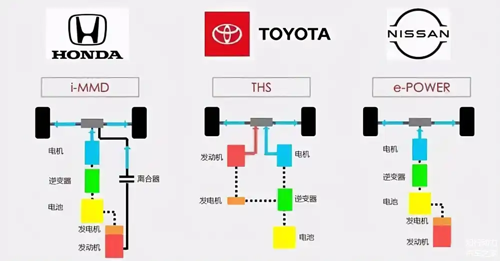
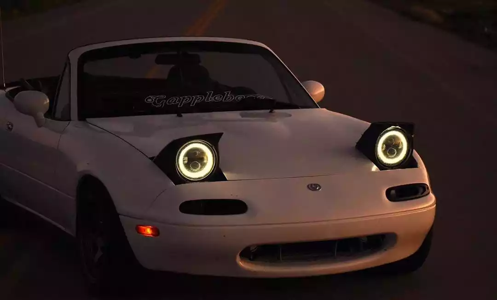
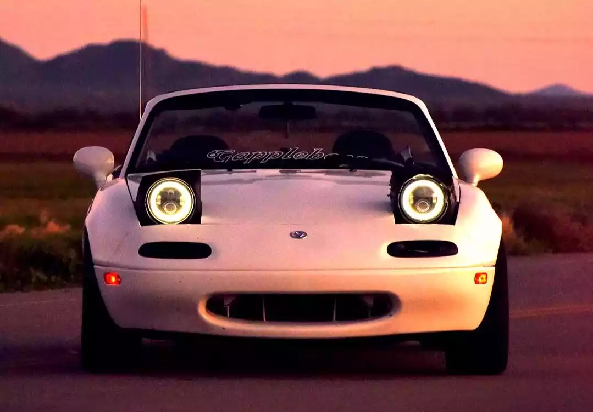
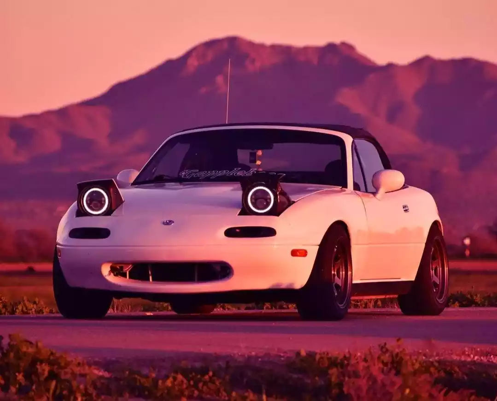
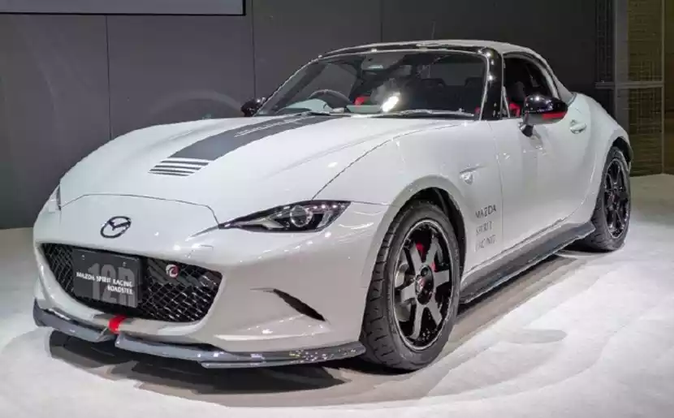
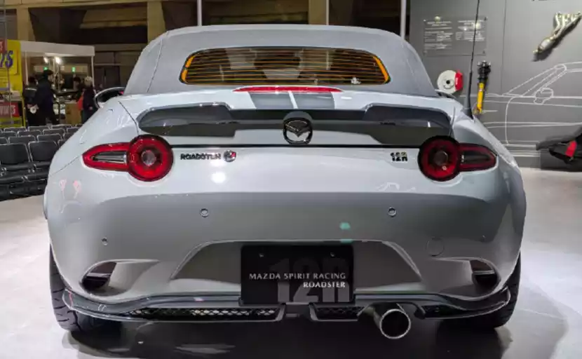
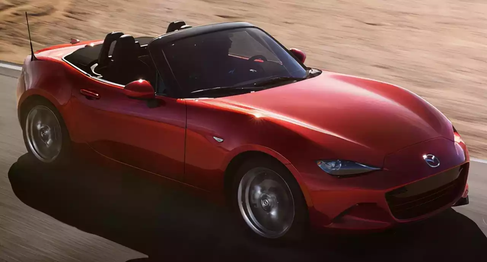
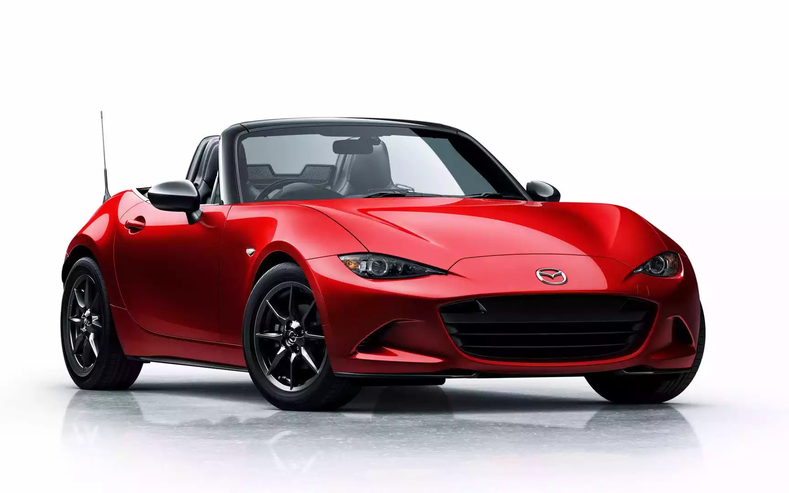

作为一名驾驶爱好者，有生之年终于迎来了自己第一辆车的选购，当然是既紧张又激动啦~

本篇将复盘自己购车的整个历程，于我而言是一个人生重要的里程碑；于大家而言，更是很好的一个反面教材（Emm，实践是检验真理的唯一标准，实操过程中还是踩了不少雷……）

让我们开始吧~

### 能源

既然要买车，你考虑好现在要买什么类型的车吗？燃油车？电车？

目前郭嘉大力推广政策补贴，行业正处于燃油车、电车过渡的阶段，所以在二者之间，有各种各样的混动类型，刚入门的小白肯定要看花眼，我这里简单介绍一下：

| 类型     | 补能  | 牌照 | 搭配          | 驱动                       | 备注                     |
| -------- | ----- | ---- | ------------- | -------------------------- | ------------------------ |
| 燃油     | 油    | 蓝牌 | 发动机        | 发动机                     | 可靠稳定，家庭的第一辆车 |
| 油电混动 | 油    | 蓝牌 | 发动机+微电池 | 发动机、电机、**共同驱动** | 丰田 Top1，巨省油        |
| 插电混动 | 油/电 | 绿牌 | 发动机+小电池 | 发动机、电机               | 看需求                   |
| 增程     | 油/电 | 绿牌 | 发动机+中电池 | 电机（发动机仅充电）       | 看需求                   |
| 纯电     | 电    | 绿牌 | 大电池        | 电机                       | 适合通勤，天天开         |

- **油电混动**只加油无需充电，搭配了一个很小的动力电池，可以在起步或者低速时用电，电量耗尽时使用发动机充电，还可以**一起发力**或者二者灵活切换，以达到省油的目的

  首选丰田双擎系列的车型，可以说是天才般的设计，全球热销，稳定可靠

- **插电混动**是搭配两套动力系统，但是来回切换使用，要么发动机要么电机驱动；而**增程**汽车则是仅靠电机驱动，发动机只负责充电

混动原理图如下，本田（HONDA）对应油电混动；丰田（TOYOTA）对应油电混动；日产（NISSAN）对应增程

具体选购哪种能源类型，没有绝对的好与绝对的坏，一定是看自己的需求，以下仅列举对应类型的**核心问题**：

- 燃油车：是否接受颗粒捕捉器？

  传统的油车，发动机国外技术领先。郭嘉大力推广国产电车，以换赛道实现汽车工业弯道超车。有两大好处：一个是可扶持本国汽车产业，带动经济复苏；另一个是减少传统燃油汽车合资企业的市场。

  既然要减占燃油车市场，就会出台对应的政策来进行限制，例如提高年审标准的 [OBD](https://baike.baidu.com/item/%E8%BD%A6%E8%BD%BD%E8%87%AA%E8%AF%8A%E6%96%AD%E7%B3%BB%E7%BB%9F/11046661) 检测；提高排放标准的国 6B。

  排放标准的提高，也就要求发动机优化出更高的效率，以减少废气排放。而大多数厂商短时间内没有技术或没有计划去做发动机的更新换代，图省事就安装一个颗粒捕捉器，相当于给汽车戴口罩，虽然能够快速应对排放标准，但是会造成堵塞问题，导致油耗升高、动力下降。

  典型的丰田双擎 23 款车型之后都加装了颗粒捕捉器，这个东西换一个也不便宜（5k-1w），私自拆卸影响年审，算是一个比较闹心的问题，如果介意的话，可以着重关注不带颗粒捕捉器的车型。

- 电车：有条件安装家用充电桩吗？

  - 没有的话，附近能解决充电问题吗？
  - 如果附近充电桩离家比较远，能否接受下雨往返不便的问题？

  城市里安装家用充电桩，还需要有固定停车位，并且小区物业同意才能安装，那一个固定车位的价格可能都让人望尘莫及了。否则，在外面充电的话有以下几个问题：

  1. 商业电价波动

     峰谷电价导致用车成本优势下降，**燃油车**一般 0.5 元/公里；电车**家用电价**一般 0.05 元/公里；外面**商用电价** 0.13 元/公里（1 元一度电），0.26 元/公里（2 元一度电）

  2. 不省心

     车开回来还得去附近充电桩充电，然后走路、骑单车回家？外面的充电桩有的本身是一个停车场，可能充电仅前两小时停车免费，那回家吃完饭之后还得赶过来挪车，遇到下雨天或者停车位都不好解决的情况下简直就是灾难

  何况现阶段，续航长一点的电车售价远高于降价的油车，中间的差价都足以油车加个好几年的油了。况且油车可以长时间存放，电车存放也会慢慢亏电，还是天天开才好

- 插电混动本质是伪需求？

  能解决充电问题当然可以选大容量的纯电车，否则当电车开还是会面临上面两点问题。纯当油车开而不充电，会导致更高的油耗，况且两套系统带来更高的维护成本，那为什么不直接买台皮实耐造的油车？

> 我自身选择的油车，发动机的轰鸣和怒吼仿佛化身一头野兽，跟随着我的狂热一同汹涌澎湃，进而在喧嚣的世界迸发出最强的生命力，人马合一
>
> 说白了就是纯粹的喜欢哈哈哈哈哈，并且结合一点现实因素：
>
> 1. 没有充电环境，不方便充电
> 2. 平常不怎么开，买回来吃灰，电车存放会亏电
> 3. 燃油车便宜大碗啊，开个 10 年发动机正值壮年；电车电池寿命可能 10 年就到 60-80% 了，换电池可能都是汽车本身的价格了
> 4. 没有续航焦虑，油表到底后还能开 100km；电车必须预留 20% 的电量用来找充电桩
> 5. 加油一分钟；充电半小时
> 6. 湖北冬冷夏热，极端气温条件下，电池性能会下降
> 7. 有跑高速的需求

### 车型

#### Mazda MX-5

My dream car is Mazda MX-5 Miata

眼馋ing~

之前一汽引入过，后来因为销量惨淡匆匆下架（国内家庭用车实用性啊；键盘侠你买我推荐，要买我不买balabala）

因此，国内保有量极少，目前只能依靠平行进口或者看看二手车

一睹 miata 美颜吧~（水晶混动红独一档的车漆）

[待补充]()

同时，也是 [@急速拍档]() 小乔的座驾

[待补充]()

这里是这两享誉全球的 mini 敞篷跑车的趣味起源

[待补充]()

#### Mazda 3 Axela

> 喜欢这辆车的车主，同级别可能就不会考虑其他车型了

这一款是我购买的车

废话不多说，放个视频欣赏先~

[待补充]()

无论是外观惊鸿一瞥，亦或是动漫《头文字D》中高桥兄弟的转子绝唱。马自达这个品牌总归是特立独行，在这个大众主流的车企里显得格格不入

但自己就是喜欢这种顽固劲儿，对于驾驶的理解，对于美学的钻研。只是吸引小部分喜欢它的群体，独有自己作为小众品牌的生存之道

这一点跟相机中的富士，有着异曲同工之妙啊！作为上个世纪的胶片厂，在数码时代独守自己的 APS-C 画幅和镜头作为卖点，在索尼佳能尼康三巨头下夹缝生存哈哈，牢牢占据自己的小众市场份额

外观设计是这辆车最大的特色，最新一代的魂动设计语言，配上加长的车头，显得无比优雅、年轻

2020 年发布以来，入围「世界年度车」大奖三强，并斩获「世界年度设计车」大奖、德国红点设计大奖「至尊奖」

前车灯【天使之眼】，后车灯四圆环，马路上实属罕见哈哈（怎么有点碰瓷 GTR 的感觉？）

2.0L 自然吸气发动机，最大马力为 158hp，最大扭矩 202 牛·米，放在家用车上妥妥够用辣~

很多人会有疑惑，明明数据没有 1.5T、2.0T 这种涡轮增压的发动机数据好看，你在这吹的这么厉害

No No 哦~这两种类型的发动机发力方式不一样哦

- 自然吸气：类似于直男，说啥是啥，油门踩多少，速度就提升多少
- 涡轮增压：类似于渣男，气氛一到，速度瞬间飙升；但气氛未到时，动力较弱

自然吸气的好处就是加塞小王子，有人变道加塞，能够精准的阻挡住前车

此时涡轮增压要么没力跟不上，要么一下窜出去造成追尾

涡轮增压因为多一个结构的原因，维修成本也会提升啦~

而需要知道的是，汽车的速度跟加不加涡轮没啥关系，涡轮提升的是汽车的加速度

而最直接影响急速的东西是排量，例如这一款 2.0L 的急速为 213km/h，思域 1.5T 急速为 200km/h

扯远啦扯远啦~

小马 6AT 的变速箱，被调教的非常聪明，以至于不需要所谓的 ”运动模式“，无论踩下油门的幅度深浅，都能够瞬间理解驾驶者的意图，整个体验下来酣畅淋漓

维修成本除了 MT（手动挡）以外，也算是最实惠的啦~，寿命也比 CVT 的长

提到了变速箱，油门踏板也有特色，采用风琴式踏板，连接到地盘，并非普通的悬空式。这样能够更加精准地控制油门开度，以及长途踩油门可以歇歇脚哈哈

甚至将油门踩到低，最后还留有薄膜键盘一般的段落感，这是小马的鸡血开关，无论当前档位、速度如何，只要踩入这个段落，变速箱都能降到极限档位，转速直接攀升 6500 转红线，带来最强功率输出！！！（冲鸭！！！）

方向盘后面其实还有两个更少见的配置——换挡拨片！

能够更加自在地体验手动驾驶的乐趣（我自身也是手动挡出身嘛）

这可不是摆设，这玩意儿降档降到齿轮打尺，升档升到红线才换挡，可见一斑

2000 转以下不觉得，到 2000 转以上的话，发动机的声音开始逐渐躁动；3000 转以上有所声响；4000 转以上就迸发轰鸣

我看过这个车相关的构造，好像在车身结构上，刻意有让中高转速发动机的声音传递到驾驶舱的设计哈哈哈哈哈

> 声浪调教的还是很好听的，但是这样的设计算是自嗨行为了吧哈哈哈，马自达的快是快乐的快哈哈哈哈哈

以操控著称的马自达，底盘的调教也非常棒，汽车整体性很好，转向能够抑止驾驶者的侧倾，让姿态保持直立

安全性也是我考虑的范畴，不过在此不多赘述，马自达的车身一直属于日系车里 t0 的级别，卡罗拉、轩逸、思域可能是别人的吸能盒。。。这个东西不怕车祸撞别人，就怕别人追尾被创飞~

22 款 - 23 款后悬挂有所减配，原因其实是最令人诟病的后排空间问题

这款车的驾驶位可以说是 vip 位置，一切为了驾驶而生；其次是副驾，后排放到同级别的家用车里，算是可有可无的感觉

后悬从独立悬挂换成了特有的碟式悬挂，减配实锤，但是调教的也还不错，并且一定程度提高了点后排空间大小，也算是向家用市场做出了妥协

> 减配也能降点价格哈哈哈

其他的普遍反馈的声音大的问题，仁者见仁，都说了本质上属于驾驶者之车，我觉得好听，网友觉得太吵哈哈哈

总之，这个价位这样的配置，车企仿佛在说：已经给你打磨成最好的驾驶者之车了，还不够？那你加预算哈哈哈

很多大厂车企光靠堆料解决的问题，在小厂面前捉襟见肘。但是正是这样不服输的转子精神，固执又专一，深深的吸引了我这个没钱又爱驾驶的”平民车手“

要问其他还有什么要补充的话。。。

- 全系配置 CarPlay，不用担心车机过时或者 cpu 算力不够导致的卡顿
- 真皮座椅对象很喜欢
- 车载音响虽然有 8 个，但是音质我总感觉不够好？
- 油耗的话，日系车普遍还好，我这个平常高架 5.8 了都（开巡航模式更省油），高速一般 120 - 150，油耗上到 7.5 了
- 后排有出风口
- 物理按钮可以盲操
- 。。。（想起来再说）

### 车型

**最低配手动挡**，只能我开 pass

**自动挡质悦与质擎**同价，但前者有天窗、后者有 2.0L 发动机，当然是要发动机

**顶配质尊**多了：钢琴黑车门饰板、白色精致镀铬内饰装饰、HUD投显、自动防眩目内后视镜、车内空气过滤器（PM2.5）、白色真皮座椅、前驻车雷达、360度全景影像驻车辅助系统、FCTA 前方横向来车预警系统、SBS-R 智能倒车刹车辅助系统(正后方)、SBS-RC 智能后车盲区刹车辅助系统(侧后方)、马自达车机

太贵了pass

最后仅列举我心目中的决赛圈：

| 项目                   | 质擎                                               | 质炫                                                         | 质雅                               | 质耀                                       | 质臻          |
| ---------------------- | -------------------------------------------------- | ------------------------------------------------------------ | ---------------------------------- | ------------------------------------------ | ------------- |
| 指导价                 | 9.99                                               | 11.29                                                        | 11.59                              | 11.99                                      | 12.29         |
| 经销商价               | 9.79 (-0.20)                                       | 10.29 (-1.00)                                                | 10.59 (-1.00)                      | 10.99 (-1.00)                              | 11.29 (-1.00) |
| 购置税                 | 8,664                                              | 9,106                                                        | 9,372                              | 9,726                                      | 9,991         |
| **落地预估（含保险）** | 11.23                                              | 11.78                                                        | 12.12                              | 12.56                                      | 12.89         |
| **差异额**             |                                                    | +13,000 +5,000（优惠后）                                  | +3,000                             | +4,000                                     | +3,000        |
| **差异项-外观**        | **轮胎**规格 205/60 R16 **外进气格栅**哑光  | **轮胎**规格 215/45 R18 **外进气格栅**钢琴黑 自动**头灯** **后视镜**电动折叠、电加热、锁车自动折叠 电动**天窗** 雨量感应**雨刷** |                                    | **明选包** **后视镜**记忆、倒车自动下翻 |               |
| **差异项-内饰**        | 黑色哑光**装饰** **中控台饰板**哑光            | 黑色镀铬**装饰** **中控台饰板**激光双层 **真皮**方向盘、换挡把手 方向盘**换挡拨片** 双区独立**空调** 主副**化妆镜灯** | **真皮**座椅                       | 主驾**电动座椅**、腰部支撑、座椅记忆       |               |
| **差异项-其他**        |                                                    | 定速**巡航** 前排无**钥匙**进入、四门车窗升降 **选装**明选安选 | **选装**明选安选 **选装**黑曜版 |                                            | **安选包**    |

- 购置税 = 购置价 / (1+13%) x 购置税率(12%)
- 明选包3000：侧后方倒车预警系统、BSM盲点监测系统（并线辅助）、LED日间行车灯（尾灯组）
- 安选包4000：MRCC 全速域自适应巡航系统、LDWS 车道偏离警示系统、LAS 车道保持辅助系统、SBS 智能前行刹车辅助系统、HBC 自适应远光灯控制系统、CTS 巡航模式智能行车辅助系统
- 黑曜版1000：亮黑运动轮毂 、亮黑后视镜 、勃艮第红真皮座椅丨精致红色缝线
- 颜色：铂刚灰2000、水晶魂动红3000

先放这日后再写，下班了

### 经销商

### 合同

### 提车

加油

### 车品

### 维护

### 保养 

### 保险

### 报废